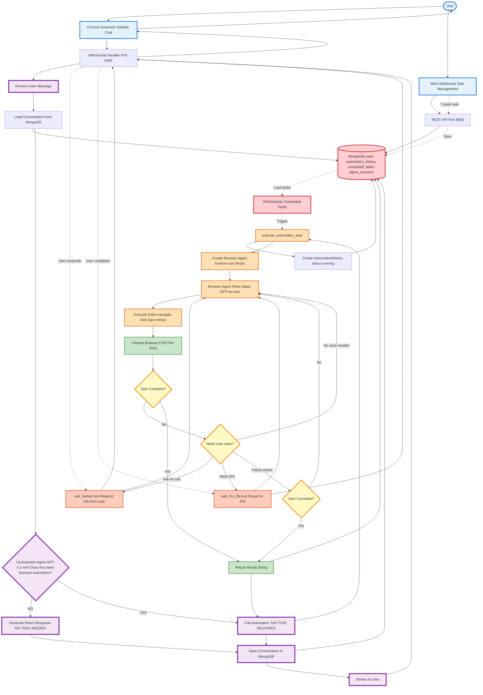
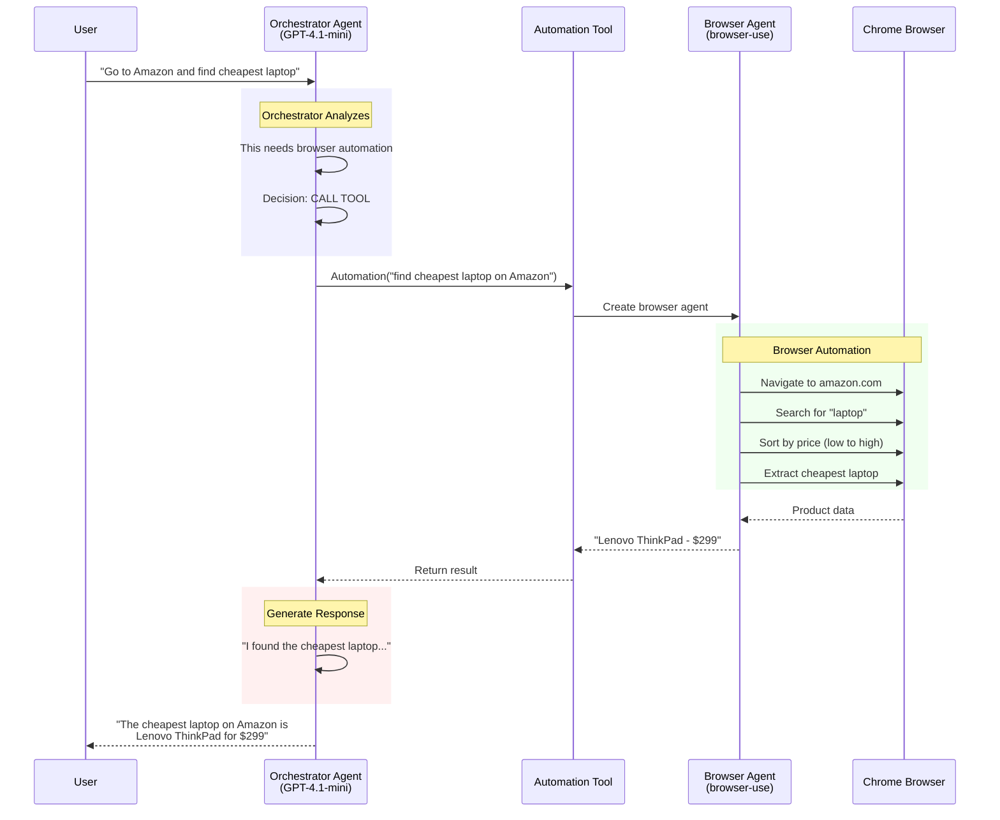
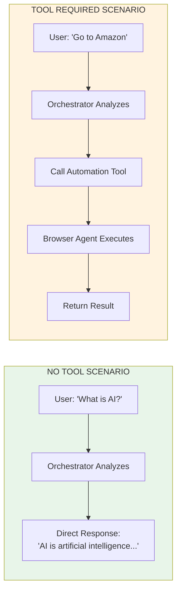
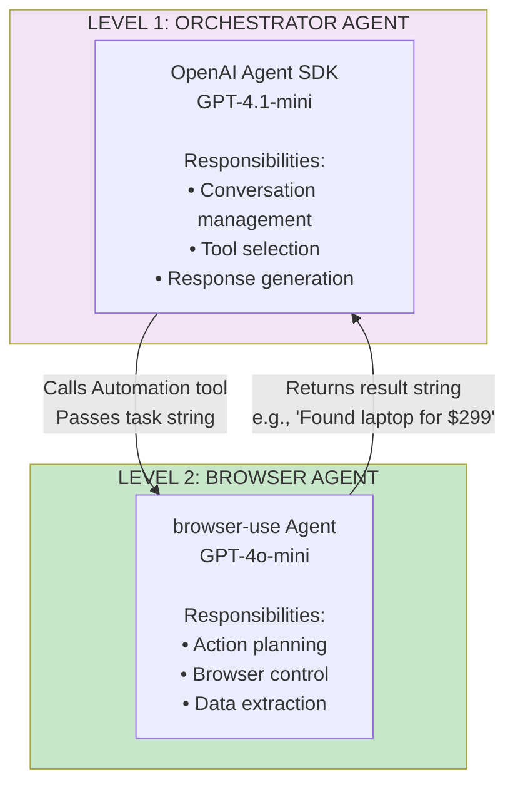
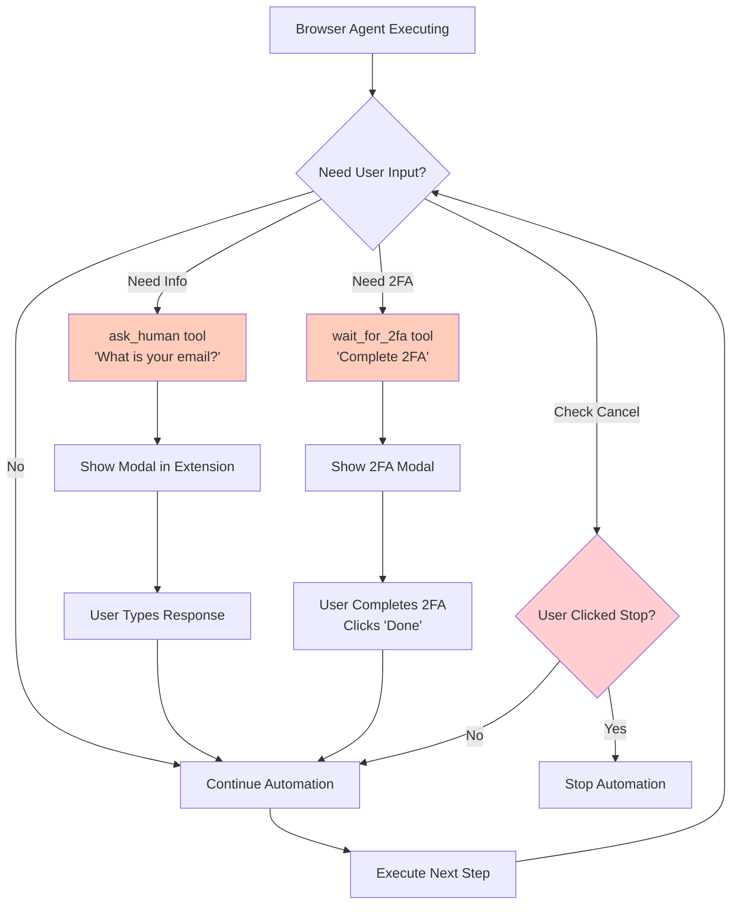
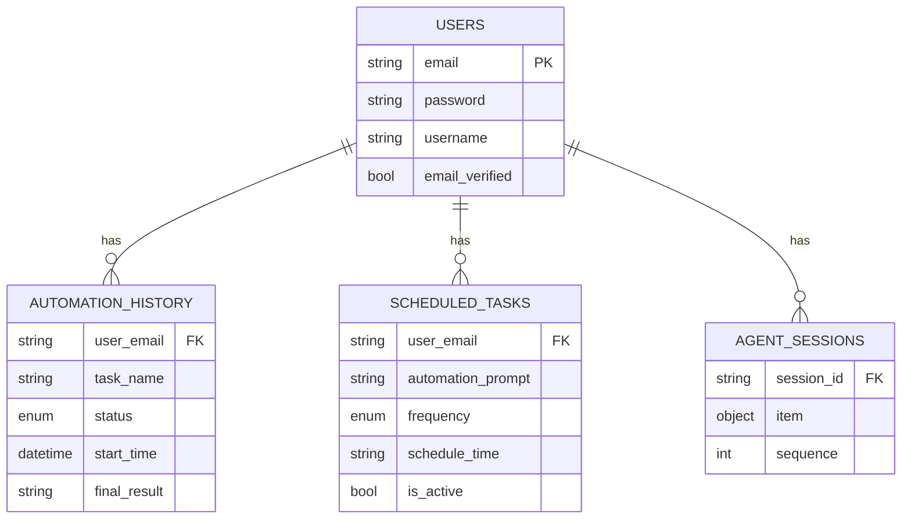
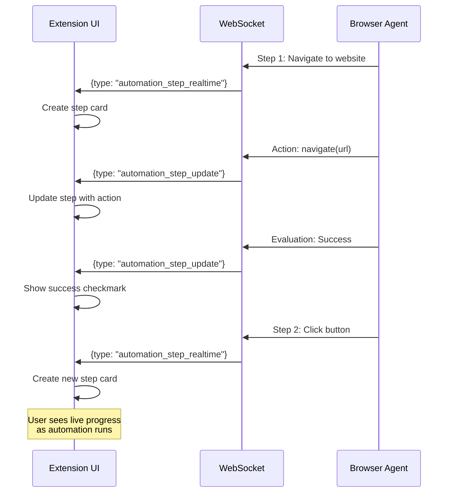
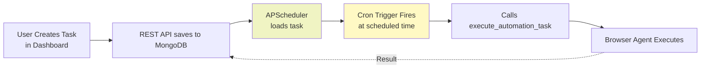
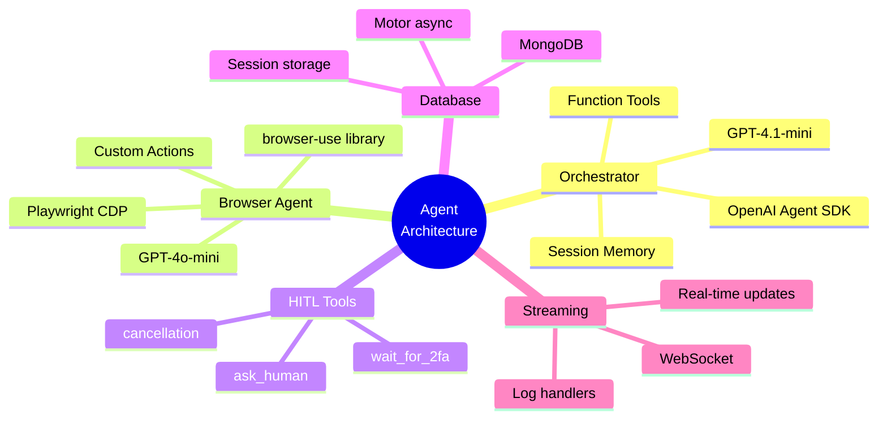
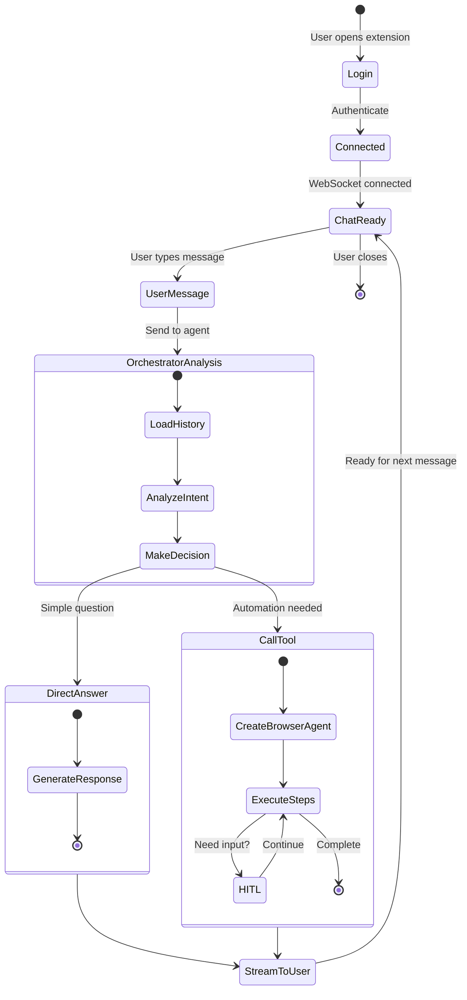

# FYP Auto - Complete Agent Architecture (Fixed - Single Image)

## 🤖 Complete Agent-Focused System Architecture

This is a **single comprehensive diagram** showing the entire system with focus on agent orchestration.



---

## 🔑 Key Points Explained

### 1️⃣ **Orchestrator Agent Decision Point**

The **Orchestrator Agent (GPT-4.1-mini)** is the brain that decides:

- **NO TOOL NEEDED** → Direct conversational response

  - Example: "What is AI?" → GPT-4 answers directly
  - Example: "Tell me a joke" → GPT-4 generates joke
- **TOOL REQUIRED** → Calls Automation Tool

  - Example: "Go to Amazon" → Calls browser automation
  - Example: "Search Google for AI" → Calls browser automation

### 2️⃣ **Browser Agent Execution**

When automation is needed:

1. Creates **Browser Agent** (browser-use library)
2. Agent **plans steps** using GPT-4o-mini
3. **Executes actions** in Chrome via CDP
4. **Checks if user input needed** (HITL)
5. **Returns result** to Orchestrator

### 3️⃣ **Human-in-the-Loop (HITL)**

During automation, the browser agent can:

- **ask_human**: Request missing information

  - "What is your email?"
  - User responds via modal → Agent continues
- **wait_for_2fa**: Pause for 2FA

  - User completes 2FA in browser
  - Clicks "Done" → Agent continues
- **Check cancellation**: User can stop anytime

  - User clicks "Stop" button
  - Agent stops and returns

---

## 📊 Example Flow: "Go to Amazon and find cheapest laptop"



---

## 🎯 Comparison: Tool vs No Tool



---

## 🔄 Agent-to-Agent Communication



---

## 👥 Human-in-the-Loop Flow



---

## 💾 Database Schema



---

## 📡 Real-Time Streaming



---

## ⏰ Task Scheduler Integration



---

## 🏗️ Technology Stack



---

## 📋 Complete User Journey



---

## 🎯 Key Architectural Benefits

| Feature                       | Benefit                                              |
| ----------------------------- | ---------------------------------------------------- |
| **Two-Level Agents**    | Orchestrator decides WHAT, Browser Agent decides HOW |
| **Tool Architecture**   | Easy to add new tools (Email, API, File operations)  |
| **Session Memory**      | Context-aware conversations across messages          |
| **HITL Integration**    | Seamless user interaction during automation          |
| **Real-Time Streaming** | Live progress updates, better UX                     |
| **Scheduled Tasks**     | Unattended automation at specific times              |

---

## 🚀 Example Scenarios

### Scenario 1: Simple Question (No Tool)

```
User: "What is browser automation?"

Orchestrator:
  ├─ Analyze: Knowledge question
  ├─ Decision: NO TOOL
  └─ Response: "Browser automation is..."

✅ Direct conversational response
```

### Scenario 2: Web Automation (Tool Required)

```
User: "Find cheapest laptop on Amazon"

Orchestrator:
  ├─ Analyze: Needs web interaction
  ├─ Decision: USE TOOL
  └─ Call: Automation("find cheapest laptop")
      │
      Browser Agent:
        ├─ Navigate to Amazon
        ├─ Search "laptop"
        ├─ Sort by price
        └─ Extract: "Lenovo - $299"

      Return to Orchestrator

  └─ Response: "I found Lenovo ThinkPad for $299"

✅ Automation executed, friendly result
```

### Scenario 3: Interactive Automation (HITL)

```
User: "Login to my email"

Orchestrator → Automation Tool → Browser Agent:
  ├─ Navigate to Gmail
  ├─ ask_human("Email?") → User: "john@example.com"
  ├─ Type email
  ├─ ask_human("Password?") → User: "********"
  ├─ Submit login
  ├─ wait_for_2fa() → User completes 2FA
  └─ Extract: "5 unread emails"

✅ Interactive automation with user input
```

---

This simplified version should render properly! The main diagram shows your complete system with focus on agent orchestration. 🎉
