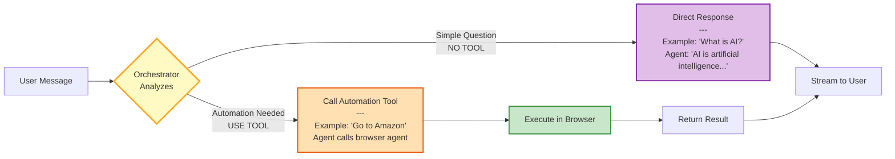
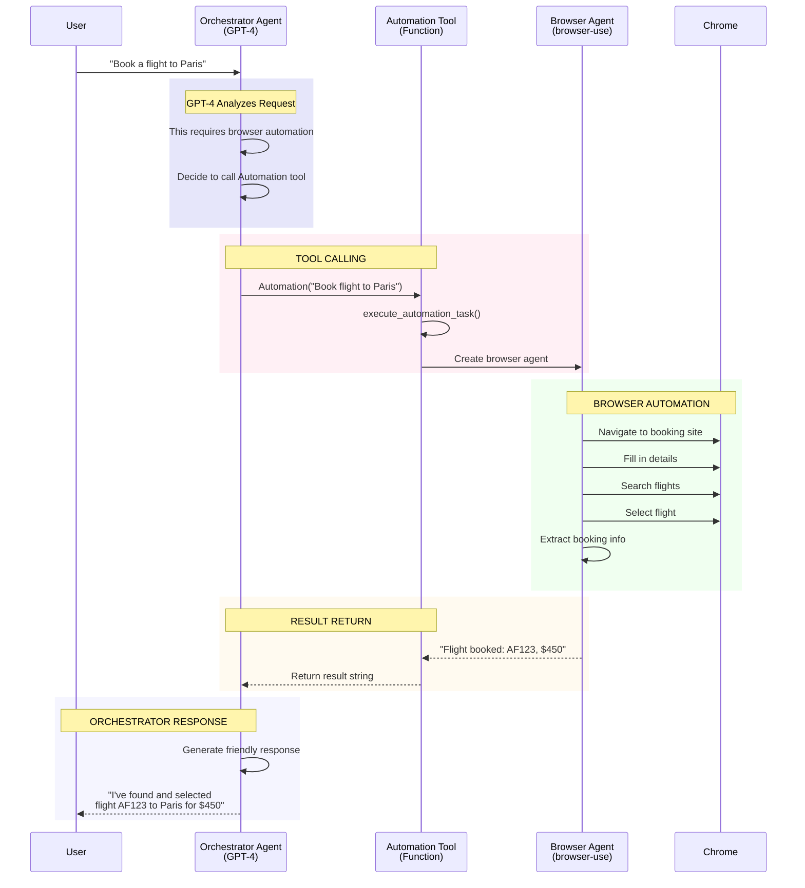
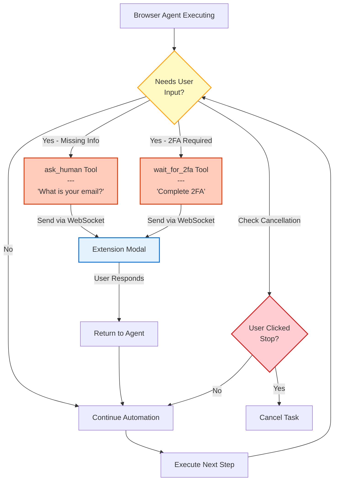
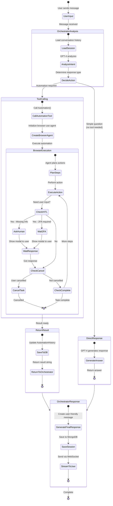
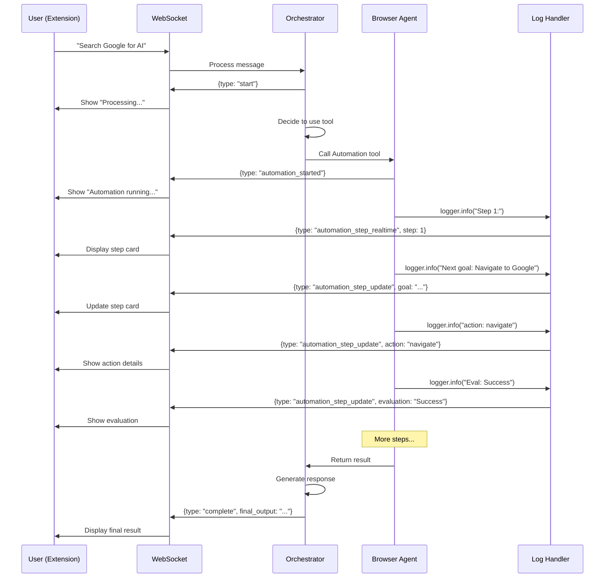

# FYP Auto - Complete Agent Architecture (Single Comprehensive Diagram)

## Agent-Centric System Architecture

This diagram shows the complete system with **focus on agent orchestration, tool calling, and execution flow**.

```mermaid
graph TB
    %% User Interface Layer
    subgraph UI["👤 USER INTERFACE LAYER"]
        USER[User]
        EXT[Chrome Extension<br/>Sidebar Chat]
        WEB[Web Dashboard<br/>Task Management]
    end

    %% API Gateway Layer
    subgraph GATEWAY["🌐 API GATEWAY LAYER"]
        WSGATE[WebSocket Handler<br/>ws://localhost:5005/ws/chat]
        HTTPGATE[REST API<br/>http://localhost:8000]
    end

    %% Agent Orchestration Layer - THE CORE
    subgraph AGENT_CORE["🤖 AGENT ORCHESTRATION CORE - OpenAI Agent SDK"]

        subgraph ORCHESTRATOR["ORCHESTRATOR AGENT (GPT-4.1-mini)"]
            ORC_INPUT[Receive User Message]
            ORC_ANALYZE{Analyze Request<br/>---<br/>Does this need<br/>browser automation?}
            ORC_DIRECT[Generate Direct Response<br/>---<br/>NO TOOL NEEDED<br/>Answer conversationally]
            ORC_TOOL_CALL[Call Automation Tool<br/>---<br/>TOOL REQUIRED<br/>Execute browser task]
            ORC_OUTPUT[Stream Response to User]
        end

        subgraph SESSION["SESSION MANAGEMENT"]
            SESS_LOAD[Load Conversation History<br/>from MongoDB]
            SESS_SAVE[Save Conversation History<br/>to MongoDB]
        end

        subgraph TOOLS["🛠️ AVAILABLE TOOLS"]
            TOOL_AUTO[Tool: Automation<br/>---<br/>Execute browser automation<br/>Returns: Task result string]
            TOOL_FUTURE[Future Tools:<br/>- Email Tool<br/>- API Tool<br/>- File Tool]
        end
    end

    %% Browser Automation Layer
    subgraph BROWSER_LAYER["🌍 BROWSER AUTOMATION LAYER"]

        subgraph AUTO_FUNC["AUTOMATION FUNCTION"]
            AUTO_START[execute_automation_task]
            AUTO_DB_START[Create AutomationHistory<br/>status: running]
            AUTO_AGENT_CREATE[Create Browser Agent<br/>browser-use library]
        end

        subgraph BROWSER_AGENT["BROWSER AGENT (browser-use)"]
            BA_INIT[Initialize Agent<br/>with LLM + Tools]
            BA_PLAN{Plan Actions<br/>---<br/>What steps needed?}
            BA_EXECUTE[Execute Action<br/>navigate | click | type | extract]
            BA_CHECK{Task Complete?}
            BA_HITL{Need User Input?}
            BA_RESULT[Return Result]
        end

        subgraph HITL_TOOLS["👥 HUMAN-IN-THE-LOOP TOOLS"]
            HITL_ASK[ask_human tool<br/>---<br/>Request user input]
            HITL_2FA[wait_for_2fa tool<br/>---<br/>Pause for 2FA]
            HITL_CANCEL{Check Cancellation<br/>Flag}
        end

        subgraph BROWSER_ENGINE["CHROME BROWSER ENGINE"]
            CHROME[Chrome Browser<br/>CDP Port 9222]
            WEBPAGE[Web Pages<br/>DOM Manipulation]
        end
    end

    %% Data & State Layer
    subgraph DATA["💾 DATA & STATE LAYER"]
        MONGODB[(MongoDB Database<br/>---<br/>Collections:<br/>• users<br/>• automation_history<br/>• scheduled_tasks<br/>• agent_sessions<br/>• verification_codes)]

        MEMORY[In-Memory State<br/>---<br/>• active_websockets<br/>• cancellation_flags<br/>• input_requests]
    end

    %% Scheduler Layer
    subgraph SCHED["⏰ TASK SCHEDULER LAYER"]
        SCHEDULER[APScheduler<br/>---<br/>Cron Triggers:<br/>• once<br/>• daily<br/>• weekly<br/>• monthly<br/>• hourly]
        SCHED_EXEC[Execute Scheduled Task<br/>---<br/>Runs automation at<br/>scheduled time]
    end

    %% ============================================
    %% CONNECTIONS - Main Flow
    %% ============================================

    %% User to Gateway
    USER -->|Types message| EXT
    USER -->|Manages tasks| WEB
    EXT -->|WebSocket| WSGATE
    WEB -->|HTTP REST| HTTPGATE

    %% Gateway to Orchestrator
    WSGATE -->|Stream message| ORC_INPUT
    HTTPGATE -->|CRUD operations| MONGODB

    %% Orchestrator Flow
    ORC_INPUT --> SESS_LOAD
    SESS_LOAD --> MONGODB
    MONGODB -.->|History| SESS_LOAD
    SESS_LOAD --> ORC_ANALYZE

    %% Decision Point - Tool or Direct Response
    ORC_ANALYZE -->|NO TOOL NEEDED<br/>e.g., "What is AI?"<br/>"Tell me a joke"| ORC_DIRECT
    ORC_ANALYZE -->|TOOL REQUIRED<br/>e.g., "Go to Amazon"<br/>"Search Google"| ORC_TOOL_CALL

    %% Direct Response Path (No Tool)
    ORC_DIRECT -->|Direct answer| ORC_OUTPUT

    %% Tool Calling Path
    ORC_TOOL_CALL -->|Calls| TOOL_AUTO
    TOOL_AUTO -->|Executes| AUTO_START

    %% Automation Execution
    AUTO_START --> AUTO_DB_START
    AUTO_DB_START --> MONGODB
    AUTO_START --> AUTO_AGENT_CREATE
    AUTO_AGENT_CREATE --> BA_INIT

    %% Browser Agent Flow
    BA_INIT --> BA_PLAN
    BA_PLAN --> BA_EXECUTE
    BA_EXECUTE -->|CDP Protocol| CHROME
    CHROME -->|Manipulates| WEBPAGE
    WEBPAGE -.->|Page data| CHROME
    CHROME -.->|Result| BA_EXECUTE

    %% Check if task complete
    BA_EXECUTE --> BA_CHECK
    BA_CHECK -->|No| BA_HITL
    BA_CHECK -->|Yes| BA_RESULT

    %% Human in the Loop
    BA_HITL -->|Needs input| HITL_ASK
    BA_HITL -->|Needs 2FA| HITL_2FA
    BA_HITL -->|Check cancel| HITL_CANCEL
    BA_HITL -->|No input needed| BA_PLAN

    %% HITL to User
    HITL_ASK -->|Request via WS| WSGATE
    HITL_2FA -->|Request via WS| WSGATE
    WSGATE -.->|Show modal| EXT
    EXT -.->|User responds| WSGATE
    WSGATE -.->|Response| HITL_ASK
    HITL_ASK -.->|Continue| BA_PLAN

    %% Cancellation
    HITL_CANCEL -->|Check flag| MEMORY
    MEMORY -.->|Cancelled?| HITL_CANCEL
    HITL_CANCEL -->|Yes| BA_RESULT
    HITL_CANCEL -->|No| BA_PLAN

    %% Browser Agent Result
    BA_RESULT -->|Result string| TOOL_AUTO
    BA_RESULT --> MONGODB
    MONGODB -->|Update history| AUTO_DB_START

    %% Tool returns to Orchestrator
    TOOL_AUTO -->|Returns result| ORC_TOOL_CALL
    ORC_TOOL_CALL --> ORC_OUTPUT

    %% Save session and send to user
    ORC_OUTPUT --> SESS_SAVE
    SESS_SAVE --> MONGODB
    ORC_OUTPUT -->|Stream response| WSGATE
    WSGATE -->|Real-time updates| EXT
    EXT -->|Display| USER

    %% Scheduler Flow
    WEB -->|Create scheduled task| HTTPGATE
    HTTPGATE -->|Save task| MONGODB
    MONGODB -.->|Load tasks| SCHEDULER
    SCHEDULER -->|Trigger at time| SCHED_EXEC
    SCHED_EXEC -->|Execute| AUTO_START

    %% Memory Management
    WSGATE -.->|Store connection| MEMORY
    EXT -.->|Cancel button| WSGATE
    WSGATE -.->|Set cancel flag| MEMORY

    %% ============================================
    %% STYLING
    %% ============================================

    classDef userStyle fill:#e3f2fd,stroke:#1976d2,stroke-width:3px,color:#000
    classDef gatewayStyle fill:#fff3e0,stroke:#f57c00,stroke-width:2px,color:#000
    classDef agentStyle fill:#f3e5f5,stroke:#7b1fa2,stroke-width:4px,color:#000
    classDef orchestratorStyle fill:#e1bee7,stroke:#6a1b9a,stroke-width:3px,color:#000
    classDef toolStyle fill:#ffe0b2,stroke:#e65100,stroke-width:2px,color:#000
    classDef browserStyle fill:#c8e6c9,stroke:#388e3c,stroke-width:3px,color:#000
    classDef browserAgentStyle fill:#a5d6a7,stroke:#2e7d32,stroke-width:2px,color:#000
    classDef hitlStyle fill:#ffccbc,stroke:#d84315,stroke-width:2px,color:#000
    classDef dataStyle fill:#ffcdd2,stroke:#c62828,stroke-width:3px,color:#000
    classDef schedStyle fill:#f0f4c3,stroke:#9e9d24,stroke-width:2px,color:#000
    classDef decisionStyle fill:#fff9c4,stroke:#f9a825,stroke-width:2px,color:#000

    class USER,EXT,WEB userStyle
    class WSGATE,HTTPGATE gatewayStyle
    class AGENT_CORE agentStyle
    class ORC_INPUT,ORC_DIRECT,ORC_TOOL_CALL,ORC_OUTPUT orchestratorStyle
    class ORC_ANALYZE,BA_PLAN,BA_CHECK,BA_HITL,HITL_CANCEL decisionStyle
    class TOOL_AUTO,TOOL_FUTURE toolStyle
    class BROWSER_LAYER browserStyle
    class BA_INIT,BA_EXECUTE,BA_RESULT browserAgentStyle
    class HITL_ASK,HITL_2FA hitlStyle
    class MONGODB,MEMORY dataStyle
    class SCHEDULER,SCHED_EXEC schedStyle
```

---

## 🔑 Key Architectural Decisions Visualized

### 1. **Orchestrator Agent Decision Flow**



### 2. **Tool Calling Mechanism**



### 3. **Human-in-the-Loop Integration**



---

## 📊 Complete Agent Execution Flow



---

## 🎯 Example Scenarios

### Scenario 1: Direct Response (No Tool)

```
User: "What is browser automation?"

Orchestrator Agent (GPT-4):
  ├─ Analyze: This is a knowledge question
  ├─ Decision: NO TOOL NEEDED
  ├─ Generate: "Browser automation is the process of..."
  └─ Stream to user

Result: Direct conversational response
```

### Scenario 2: Browser Automation (Tool Required)

```
User: "Go to Amazon and find the cheapest laptop"

Orchestrator Agent (GPT-4):
  ├─ Analyze: This requires web interaction
  ├─ Decision: USE AUTOMATION TOOL
  └─ Call: Automation("Go to Amazon and find the cheapest laptop")
      │
      └─ Browser Agent (browser-use):
          ├─ Step 1: Navigate to amazon.com
          ├─ Step 2: Search for "laptop"
          ├─ Step 3: Sort by price (low to high)
          ├─ Step 4: Extract cheapest option
          └─ Return: "Lenovo ThinkPad - $299"

      Return to Orchestrator: "Found: Lenovo ThinkPad - $299"

Orchestrator Agent:
  ├─ Generate: "I found the cheapest laptop on Amazon..."
  └─ Stream to user

Result: Automation executed, friendly response
```

### Scenario 3: Human-in-the-Loop

```
User: "Login to my email and check unread messages"

Orchestrator Agent:
  └─ Call: Automation("Login to email and check unread")
      │
      └─ Browser Agent:
          ├─ Step 1: Navigate to gmail.com
          ├─ Step 2: Find login form
          ├─ Step 3: Need email address
          │   └─ Call: ask_human("What is your email?")
          │       ├─ Send to user via WebSocket
          │       ├─ User responds: "john@example.com"
          │       └─ Return: "john@example.com"
          ├─ Step 4: Type email
          ├─ Step 5: Need password
          │   └─ Call: ask_human("What is your password?")
          │       └─ User responds: "********"
          ├─ Step 6: Submit login
          ├─ Step 7: 2FA detected
          │   └─ Call: wait_for_2fa()
          │       ├─ User completes 2FA in browser
          │       └─ User clicks "Done" in modal
          ├─ Step 8: Check unread emails
          └─ Return: "You have 5 unread emails..."

Result: Interactive automation with user input
```

---

## 🔄 Real-Time Streaming



---

## 📦 Technology Stack (Agent-Focused)

| Layer | Technology | Purpose |
|-------|-----------|---------|
| **Orchestrator Agent** | OpenAI Agent SDK + GPT-4.1-mini | Decision making, tool selection, conversation |
| **Browser Agent** | browser-use library | Web automation execution |
| **Session Memory** | MongoDB + MongoDBSession | Conversation persistence |
| **Tool Interface** | @function_tool decorator | Connect orchestrator to browser agent |
| **HITL Tools** | @tools.action decorator | Human input during automation |
| **Streaming** | Runner.run_streamed() | Real-time updates |
| **Browser Control** | Chrome DevTools Protocol | Execute browser actions |
| **LLM** | GPT-4o-mini (for browser agent) | Action planning in browser-use |

---

## 🎨 Agent Architecture Layers

```
┌─────────────────────────────────────────────────────────────┐
│                    USER INTERFACE                            │
│  Chrome Extension (WebSocket) + Web Dashboard (HTTP)        │
└────────────────────┬────────────────────────────────────────┘
                     │
┌────────────────────┴────────────────────────────────────────┐
│              ORCHESTRATOR AGENT LAYER                        │
│  ┌──────────────────────────────────────────────────────┐  │
│  │  OpenAI Agent SDK (GPT-4.1-mini)                     │  │
│  │  • Conversation management                           │  │
│  │  • Intent analysis                                   │  │
│  │  • Tool selection decision                           │  │
│  │  • Response generation                               │  │
│  └──────────────┬───────────────────────────────────────┘  │
│                 │                                            │
│     ┌───────────┴──────────┐                                │
│     │                      │                                │
│     ▼                      ▼                                │
│  [Direct]             [Tool Call]                           │
│  Response             Automation()                          │
└───────────────────────────┬────────────────────────────────┘
                            │
┌───────────────────────────┴────────────────────────────────┐
│           BROWSER AUTOMATION AGENT LAYER                    │
│  ┌──────────────────────────────────────────────────────┐  │
│  │  browser-use Agent (GPT-4o-mini)                     │  │
│  │  • Action planning                                   │  │
│  │  • Step execution                                    │  │
│  │  • Human-in-the-loop tools                           │  │
│  │    - ask_human()                                     │  │
│  │    - wait_for_2fa()                                  │  │
│  │  • Result extraction                                 │  │
│  └──────────────┬───────────────────────────────────────┘  │
└─────────────────┴────────────────────────────────────────────┘
                  │
┌─────────────────┴────────────────────────────────────────────┐
│              BROWSER EXECUTION LAYER                         │
│  Chrome Browser (CDP) → Web Pages → DOM Manipulation        │
└──────────────────────────────────────────────────────────────┘
```

---

## 🚀 Agent Capabilities

### Orchestrator Agent Can:
- ✅ Understand natural language requests
- ✅ Maintain conversation context across messages
- ✅ Decide when automation is needed vs. direct response
- ✅ Call multiple tools (currently: Automation, future: Email, API, etc.)
- ✅ Generate user-friendly responses
- ✅ Stream responses in real-time

### Browser Agent Can:
- ✅ Plan multi-step automation tasks
- ✅ Navigate websites
- ✅ Click, type, scroll, extract data
- ✅ Ask user for input mid-task
- ✅ Wait for 2FA completion
- ✅ Handle dynamic web content
- ✅ Be cancelled by user

### System Can:
- ✅ Execute scheduled automation tasks
- ✅ Store automation history
- ✅ Provide real-time streaming updates
- ✅ Support multiple concurrent users (with browser pool)
- ✅ Persist conversation memory

---

This single comprehensive diagram shows your entire project with **complete focus on the agent architecture**, tool calling mechanisms, and execution flows!
