# FYP Auto - Complete System Architecture & Flow Diagram

## Table of Contents
1. [System Overview](#system-overview)
2. [High-Level Architecture](#high-level-architecture)
3. [Component Interaction Diagram](#component-interaction-diagram)
4. [Authentication Flow](#authentication-flow)
5. [Automation Execution Flow](#automation-execution-flow)
6. [Task Scheduling Flow](#task-scheduling-flow)
7. [Database Schema](#database-schema)
8. [API Endpoints Map](#api-endpoints-map)
9. [WebSocket Communication Flow](#websocket-communication-flow)
10. [Human-in-the-Loop Flow](#human-in-the-loop-flow)
11. [Complete End-to-End Flow](#complete-end-to-end-flow)

---

## System Overview

**FYP Auto** is an intelligent browser automation platform with:
- **OpenAI Agent SDK** orchestration
- **browser-use** library for web automation
- **Chrome Extension** interface
- **Web Dashboard** for management
- **Real-time WebSocket** streaming
- **Task Scheduling** with APScheduler
- **MongoDB** persistence

---

## High-Level Architecture

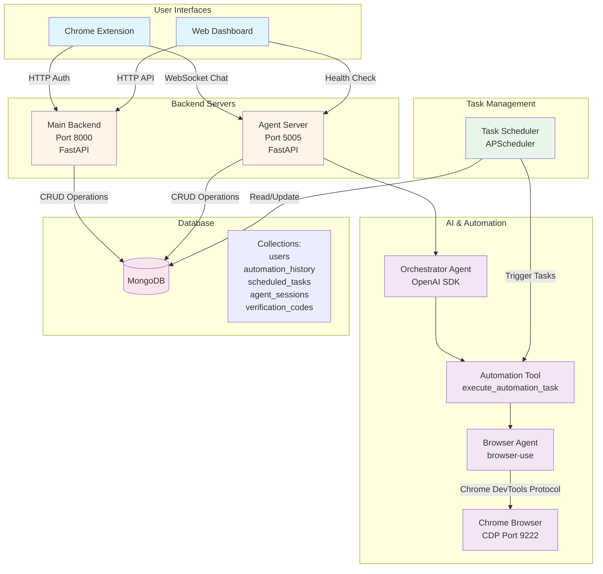
```mermaid
graph TB
    subgraph "User Interfaces"
        A1[Chrome Extension]
        A2[Web Dashboard]
    end

    subgraph "Backend Servers"
        B1[Main Backend<br/>Port 8000<br/>FastAPI]
        B2[Agent Server<br/>Port 5005<br/>FastAPI]
    end

    subgraph "AI & Automation"
        C1[Orchestrator Agent<br/>OpenAI SDK]
        C2[Automation Tool<br/>execute_automation_task]
        C3[Browser Agent<br/>browser-use]
        C4[Chrome Browser<br/>CDP Port 9222]
    end

    subgraph "Task Management"
        D1[Task Scheduler<br/>APScheduler]
    end

    subgraph "Database"
        E1[(MongoDB)]
        E2[Collections:<br/>users<br/>automation_history<br/>scheduled_tasks<br/>agent_sessions<br/>verification_codes]
    end

    A1 -->|WebSocket Chat| B2
    A1 -->|HTTP Auth| B1
    A2 -->|HTTP API| B1
    A2 -->|Health Check| B2

    B1 -->|CRUD Operations| E1
    B2 -->|CRUD Operations| E1

    B2 --> C1
    C1 --> C2
    C2 --> C3
    C3 -->|Chrome DevTools Protocol| C4

    D1 -->|Trigger Tasks| C2
    D1 -->|Read/Update| E1

    style A1 fill:#e1f5ff
    style A2 fill:#e1f5ff
    style B1 fill:#fff4e6
    style B2 fill:#fff4e6
    style C1 fill:#f3e5f5
    style C2 fill:#f3e5f5
    style C3 fill:#f3e5f5
    style C4 fill:#f3e5f5
    style D1 fill:#e8f5e9
    style E1 fill:#fce4ec
```

---

## Component Interaction Diagram

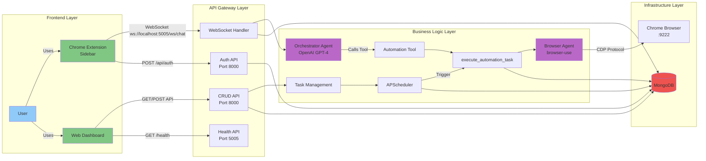
```mermaid
graph LR
    subgraph "Frontend Layer"
        U1[User]
        U1 -->|Uses| EXT[Chrome Extension<br/>Sidebar]
        U1 -->|Uses| WEB[Web Dashboard]
    end

    subgraph "API Gateway Layer"
        EXT -->|WebSocket ws://localhost:5005/ws/chat| WS[WebSocket Handler]
        EXT -->|POST /api/auth| AUTH[Auth API<br/>Port 8000]
        WEB -->|GET/POST API| CRUD[CRUD API<br/>Port 8000]
        WEB -->|GET /health| HEALTH[Health API<br/>Port 5005]
    end

    subgraph "Business Logic Layer"
        WS --> ORC[Orchestrator Agent<br/>OpenAI GPT-4]
        ORC -->|Calls Tool| AUTOTOOL[Automation Tool]
        AUTOTOOL --> EXEC[execute_automation_task]
        EXEC --> BROWSER[Browser Agent<br/>browser-use]

        CRUD --> TASKAPI[Task Management]
        TASKAPI --> SCHED[APScheduler]
        SCHED -->|Trigger| EXEC
    end

    subgraph "Infrastructure Layer"
        BROWSER -->|CDP Protocol| CHROME[Chrome Browser<br/>:9222]

        AUTH --> DB[(MongoDB)]
        CRUD --> DB
        WS --> DB
        EXEC --> DB
        SCHED --> DB
    end

    style U1 fill:#90caf9
    style EXT fill:#81c784
    style WEB fill:#81c784
    style ORC fill:#ba68c8
    style BROWSER fill:#ba68c8
    style DB fill:#ef5350
```

---

## Authentication Flow

### Email/Password Signup Flow

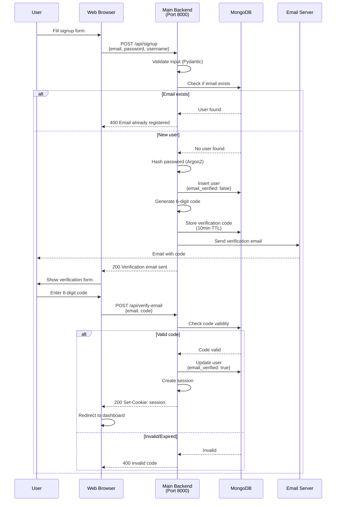
```mermaid
sequenceDiagram
    participant U as User
    participant W as Web Browser
    participant API as Main Backend<br/>(Port 8000)
    participant DB as MongoDB
    participant SMTP as Email Server

    U->>W: Fill signup form
    W->>API: POST /api/signup<br/>{email, password, username}
    API->>API: Validate input (Pydantic)
    API->>DB: Check if email exists
    alt Email exists
        DB-->>API: User found
        API-->>W: 400 Email already registered
    else New user
        DB-->>API: No user found
        API->>API: Hash password (Argon2)
        API->>DB: Insert user<br/>{email_verified: false}
        API->>API: Generate 6-digit code
        API->>DB: Store verification code<br/>(10min TTL)
        API->>SMTP: Send verification email
        SMTP-->>U: Email with code
        API-->>W: 200 Verification email sent
        W->>U: Show verification form
        U->>W: Enter 6-digit code
        W->>API: POST /api/verify-email<br/>{email, code}
        API->>DB: Check code validity
        alt Valid code
            DB-->>API: Code valid
            API->>DB: Update user<br/>{email_verified: true}
            API->>API: Create session
            API-->>W: 200 Set-Cookie: session
            W->>W: Redirect to dashboard
        else Invalid/Expired
            DB-->>API: Invalid
            API-->>W: 400 Invalid code
        end
    end
```

### Google OAuth Flow (Extension)

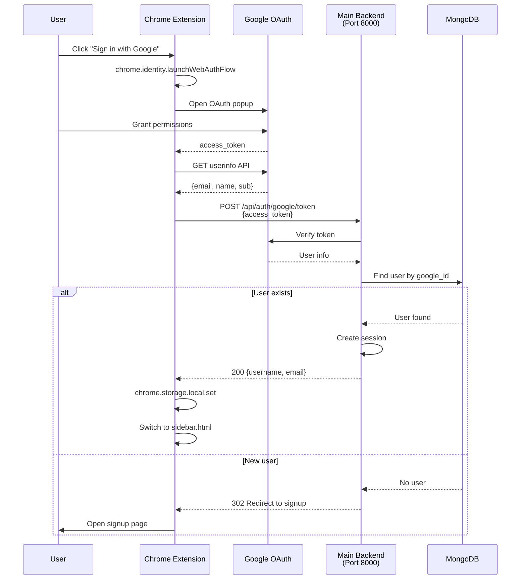
```mermaid
sequenceDiagram
    participant U as User
    participant EXT as Chrome Extension
    participant G as Google OAuth
    participant API as Main Backend<br/>(Port 8000)
    participant DB as MongoDB

    U->>EXT: Click "Sign in with Google"
    EXT->>EXT: chrome.identity.launchWebAuthFlow
    EXT->>G: Open OAuth popup
    U->>G: Grant permissions
    G-->>EXT: access_token
    EXT->>G: GET userinfo API
    G-->>EXT: {email, name, sub}
    EXT->>API: POST /api/auth/google/token<br/>{access_token}
    API->>G: Verify token
    G-->>API: User info
    API->>DB: Find user by google_id
    alt User exists
        DB-->>API: User found
        API->>API: Create session
        API-->>EXT: 200 {username, email}
        EXT->>EXT: chrome.storage.local.set
        EXT->>EXT: Switch to sidebar.html
    else New user
        DB-->>API: No user
        API-->>EXT: 302 Redirect to signup
        EXT->>U: Open signup page
    end
```

---

## Automation Execution Flow

### Complete Orchestrator Pattern Flow

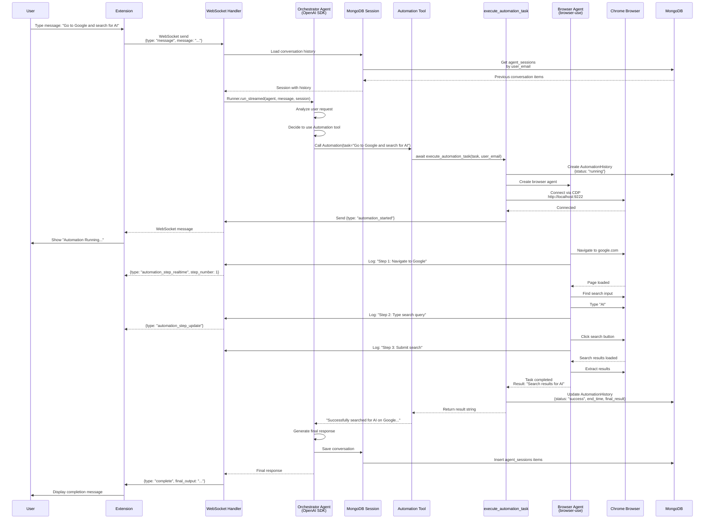
```mermaid
sequenceDiagram
    participant U as User
    participant EXT as Extension
    participant WS as WebSocket Handler
    participant ORC as Orchestrator Agent<br/>(OpenAI SDK)
    participant SESS as MongoDB Session
    participant TOOL as Automation Tool
    participant EXEC as execute_automation_task
    participant BA as Browser Agent<br/>(browser-use)
    participant CHROME as Chrome Browser
    participant DB as MongoDB

    U->>EXT: Type message: "Go to Google and search for AI"
    EXT->>WS: WebSocket send<br/>{type: "message", message: "..."}
    WS->>SESS: Load conversation history
    SESS->>DB: Get agent_sessions<br/>by user_email
    DB-->>SESS: Previous conversation items
    SESS-->>WS: Session with history

    WS->>ORC: Runner.run_streamed(agent, message, session)
    ORC->>ORC: Analyze user request
    ORC->>ORC: Decide to use Automation tool
    ORC->>TOOL: Call Automation(task="Go to Google and search for AI")

    TOOL->>EXEC: await execute_automation_task(task, user_email)
    EXEC->>DB: Create AutomationHistory<br/>{status: "running"}
    EXEC->>BA: Create browser agent
    EXEC->>CHROME: Connect via CDP<br/>http://localhost:9222
    CHROME-->>EXEC: Connected

    EXEC->>WS: Send {type: "automation_started"}
    WS-->>EXT: WebSocket message
    EXT->>U: Show "Automation Running..."

    BA->>CHROME: Navigate to google.com
    BA->>WS: Log: "Step 1: Navigate to Google"
    WS-->>EXT: {type: "automation_step_realtime", step_number: 1}
    CHROME-->>BA: Page loaded

    BA->>CHROME: Find search input
    BA->>CHROME: Type "AI"
    BA->>WS: Log: "Step 2: Type search query"
    WS-->>EXT: {type: "automation_step_update"}

    BA->>CHROME: Click search button
    BA->>WS: Log: "Step 3: Submit search"
    CHROME-->>BA: Search results loaded

    BA->>CHROME: Extract results
    BA-->>EXEC: Task completed<br/>Result: "Search results for AI"

    EXEC->>DB: Update AutomationHistory<br/>{status: "success", end_time, final_result}
    EXEC-->>TOOL: Return result string
    TOOL-->>ORC: "Successfully searched for AI on Google..."

    ORC->>ORC: Generate final response
    ORC->>SESS: Save conversation
    SESS->>DB: Insert agent_sessions items

    ORC-->>WS: Final response
    WS->>EXT: {type: "complete", final_output: "..."}
    EXT->>U: Display completion message
```

### Real-Time Step Streaming Flow

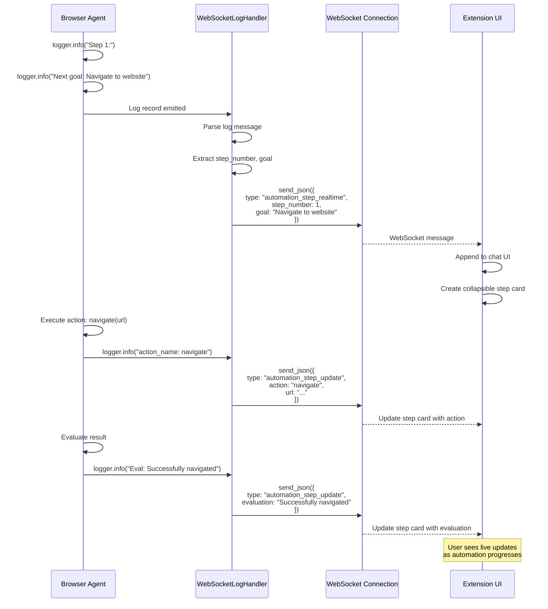
```mermaid
sequenceDiagram
    participant BA as Browser Agent
    participant LOG as WebSocketLogHandler
    participant WS as WebSocket Connection
    participant EXT as Extension UI

    BA->>BA: logger.info("Step 1:")
    BA->>BA: logger.info("Next goal: Navigate to website")

    BA->>LOG: Log record emitted
    LOG->>LOG: Parse log message
    LOG->>LOG: Extract step_number, goal
    LOG->>WS: send_json({<br/>  type: "automation_step_realtime",<br/>  step_number: 1,<br/>  goal: "Navigate to website"<br/>})
    WS-->>EXT: WebSocket message
    EXT->>EXT: Append to chat UI
    EXT->>EXT: Create collapsible step card

    BA->>BA: Execute action: navigate(url)
    BA->>LOG: logger.info("action_name: navigate")
    LOG->>WS: send_json({<br/>  type: "automation_step_update",<br/>  action: "navigate",<br/>  url: "..."<br/>})
    WS-->>EXT: Update step card with action

    BA->>BA: Evaluate result
    BA->>LOG: logger.info("Eval: Successfully navigated")
    LOG->>WS: send_json({<br/>  type: "automation_step_update",<br/>  evaluation: "Successfully navigated"<br/>})
    WS-->>EXT: Update step card with evaluation

    Note over EXT: User sees live updates<br/>as automation progresses
```

---

## Task Scheduling Flow

### Scheduled Task Creation

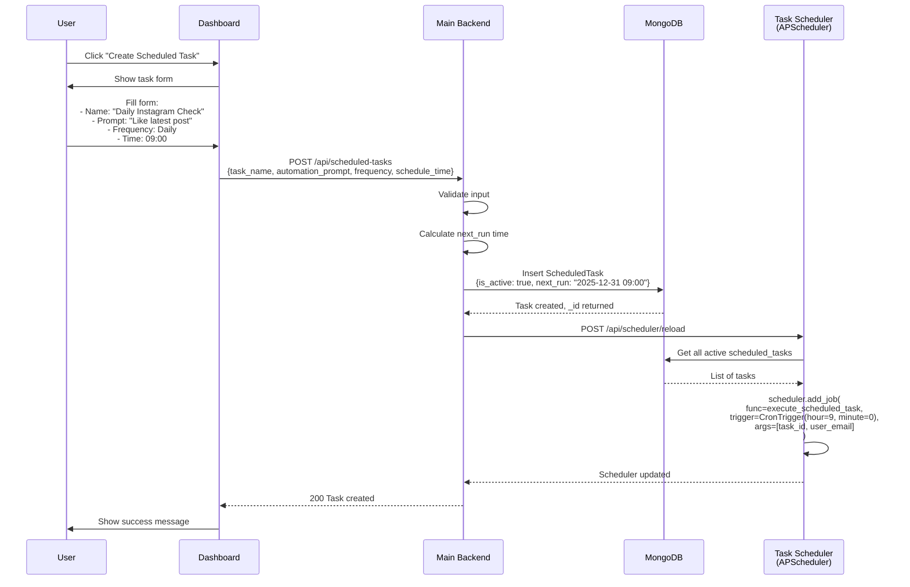
```mermaid
sequenceDiagram
    participant U as User
    participant DASH as Dashboard
    participant API as Main Backend
    participant DB as MongoDB
    participant SCHED as Task Scheduler<br/>(APScheduler)

    U->>DASH: Click "Create Scheduled Task"
    DASH->>U: Show task form
    U->>DASH: Fill form:<br/>- Name: "Daily Instagram Check"<br/>- Prompt: "Like latest post"<br/>- Frequency: Daily<br/>- Time: 09:00
    DASH->>API: POST /api/scheduled-tasks<br/>{task_name, automation_prompt, frequency, schedule_time}

    API->>API: Validate input
    API->>API: Calculate next_run time
    API->>DB: Insert ScheduledTask<br/>{is_active: true, next_run: "2025-12-31 09:00"}
    DB-->>API: Task created, _id returned

    API->>SCHED: POST /api/scheduler/reload
    SCHED->>DB: Get all active scheduled_tasks
    DB-->>SCHED: List of tasks
    SCHED->>SCHED: scheduler.add_job(<br/>  func=execute_scheduled_task,<br/>  trigger=CronTrigger(hour=9, minute=0),<br/>  args=[task_id, user_email]<br/>)
    SCHED-->>API: Scheduler updated
    API-->>DASH: 200 Task created
    DASH->>U: Show success message
```

### Scheduled Task Execution

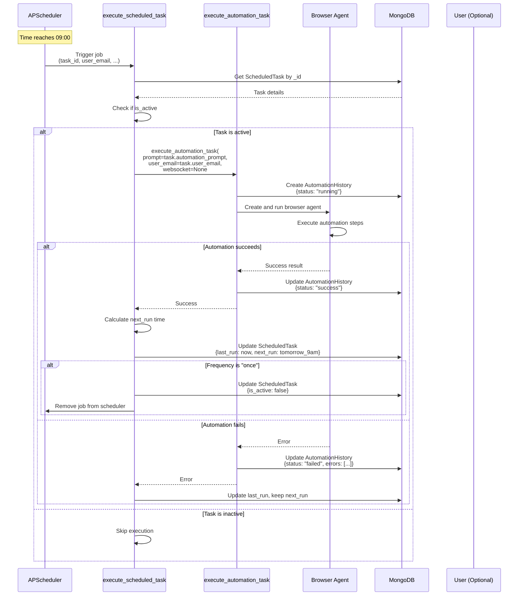
```mermaid
sequenceDiagram
    participant SCHED as APScheduler
    participant FUNC as execute_scheduled_task
    participant EXEC as execute_automation_task
    participant BA as Browser Agent
    participant DB as MongoDB
    participant U as User (Optional)

    Note over SCHED: Time reaches 09:00
    SCHED->>FUNC: Trigger job<br/>(task_id, user_email, ...)
    FUNC->>DB: Get ScheduledTask by _id
    DB-->>FUNC: Task details

    FUNC->>FUNC: Check if is_active
    alt Task is active
        FUNC->>EXEC: execute_automation_task(<br/>  prompt=task.automation_prompt,<br/>  user_email=task.user_email,<br/>  websocket=None  # No streaming<br/>)

        EXEC->>DB: Create AutomationHistory<br/>{status: "running"}
        EXEC->>BA: Create and run browser agent
        BA->>BA: Execute automation steps

        alt Automation succeeds
            BA-->>EXEC: Success result
            EXEC->>DB: Update AutomationHistory<br/>{status: "success"}
            EXEC-->>FUNC: Success

            FUNC->>FUNC: Calculate next_run time
            FUNC->>DB: Update ScheduledTask<br/>{last_run: now, next_run: tomorrow_9am}

            alt Frequency is "once"
                FUNC->>DB: Update ScheduledTask<br/>{is_active: false}
                FUNC->>SCHED: Remove job from scheduler
            end

        else Automation fails
            BA-->>EXEC: Error
            EXEC->>DB: Update AutomationHistory<br/>{status: "failed", errors: [...]}
            EXEC-->>FUNC: Error
            FUNC->>DB: Update last_run, keep next_run
        end

    else Task is inactive
        FUNC->>FUNC: Skip execution
    end
```

### Missed Task Handling (On Server Startup)

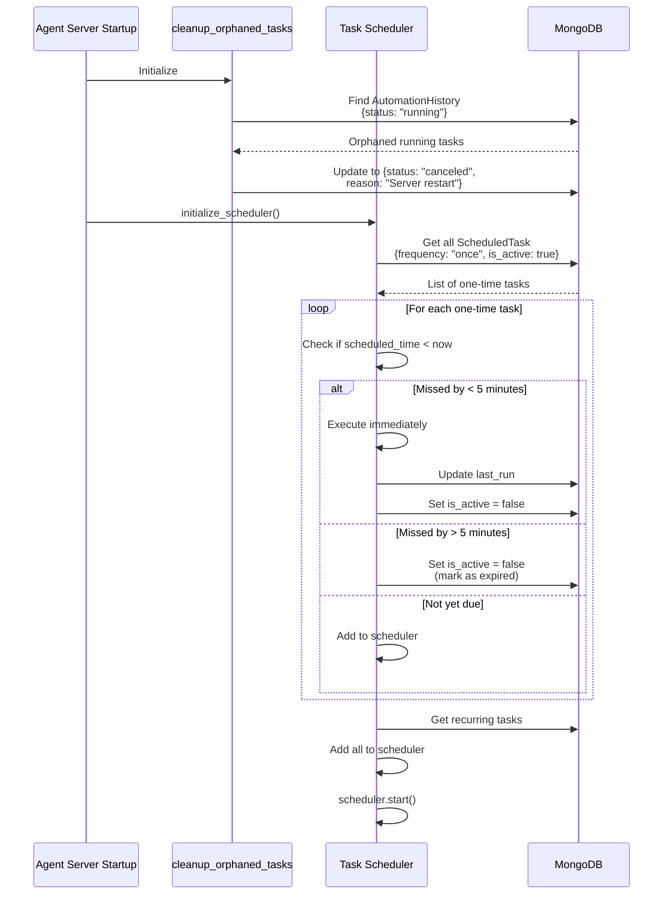
```mermaid
sequenceDiagram
    participant SERVER as Agent Server Startup
    participant CLEAN as cleanup_orphaned_tasks
    participant SCHED as Task Scheduler
    participant DB as MongoDB

    SERVER->>CLEAN: Initialize
    CLEAN->>DB: Find AutomationHistory<br/>{status: "running"}
    DB-->>CLEAN: Orphaned running tasks
    CLEAN->>DB: Update to {status: "canceled",<br/>reason: "Server restart"}

    SERVER->>SCHED: initialize_scheduler()
    SCHED->>DB: Get all ScheduledTask<br/>{frequency: "once", is_active: true}
    DB-->>SCHED: List of one-time tasks

    loop For each one-time task
        SCHED->>SCHED: Check if scheduled_time < now
        alt Missed by < 5 minutes
            SCHED->>SCHED: Execute immediately
            SCHED->>DB: Update last_run
            SCHED->>DB: Set is_active = false
        else Missed by > 5 minutes
            SCHED->>DB: Set is_active = false<br/>(mark as expired)
        else Not yet due
            SCHED->>SCHED: Add to scheduler
        end
    end

    SCHED->>DB: Get recurring tasks
    SCHED->>SCHED: Add all to scheduler
    SCHED->>SCHED: scheduler.start()
```

---

## Database Schema

### MongoDB Collections and Relationships

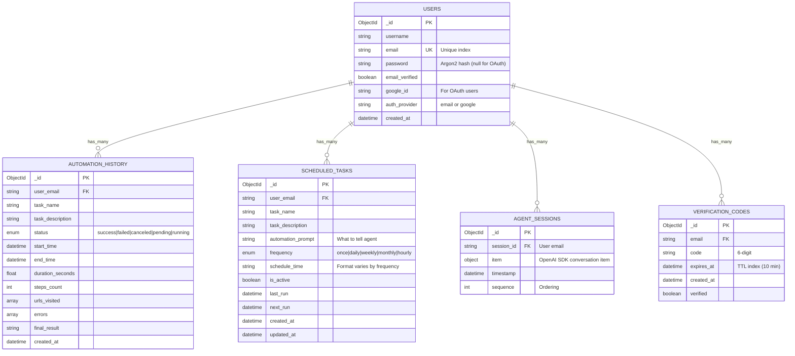
```mermaid
erDiagram
    USERS ||--o{ AUTOMATION_HISTORY : "has_many"
    USERS ||--o{ SCHEDULED_TASKS : "has_many"
    USERS ||--o{ AGENT_SESSIONS : "has_many"
    USERS ||--o{ VERIFICATION_CODES : "has_many"

    USERS {
        ObjectId _id PK
        string username
        string email UK "Unique index"
        string password "Argon2 hash (null for OAuth)"
        boolean email_verified
        string google_id "For OAuth users"
        string auth_provider "email or google"
        datetime created_at
    }

    VERIFICATION_CODES {
        ObjectId _id PK
        string email FK
        string code "6-digit"
        datetime expires_at "TTL index (10 min)"
        datetime created_at
        boolean verified
    }

    AUTOMATION_HISTORY {
        ObjectId _id PK
        string user_email FK
        string task_name
        string task_description
        enum status "success|failed|canceled|pending|running"
        datetime start_time
        datetime end_time
        float duration_seconds
        int steps_count
        array urls_visited
        array errors
        string final_result
        datetime created_at
    }

    SCHEDULED_TASKS {
        ObjectId _id PK
        string user_email FK
        string task_name
        string task_description
        string automation_prompt "What to tell agent"
        enum frequency "once|daily|weekly|monthly|hourly"
        string schedule_time "Format varies by frequency"
        boolean is_active
        datetime last_run
        datetime next_run
        datetime created_at
        datetime updated_at
    }

    AGENT_SESSIONS {
        ObjectId _id PK
        string session_id FK "User email"
        object item "OpenAI SDK conversation item"
        datetime timestamp
        int sequence "Ordering"
    }
```

### Schedule Time Formats

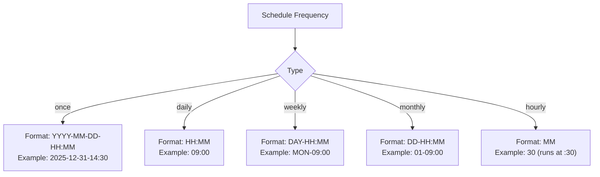
```mermaid
graph TB
    A[Schedule Frequency] --> B{Type}
    B -->|once| C["Format: YYYY-MM-DD-HH:MM<br/>Example: 2025-12-31-14:30"]
    B -->|daily| D["Format: HH:MM<br/>Example: 09:00"]
    B -->|weekly| E["Format: DAY-HH:MM<br/>Example: MON-09:00"]
    B -->|monthly| F["Format: DD-HH:MM<br/>Example: 01-09:00"]
    B -->|hourly| G["Format: MM<br/>Example: 30 (runs at :30)"]
```

---

## API Endpoints Map

### Main Backend (Port 8000)

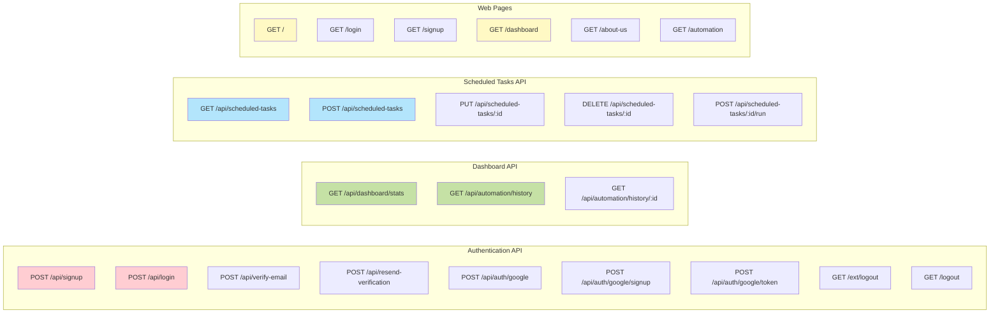
```mermaid
graph LR
    subgraph "Authentication API"
        A1[POST /api/signup]
        A2[POST /api/login]
        A3[POST /api/verify-email]
        A4[POST /api/resend-verification]
        A5[POST /api/auth/google]
        A6[POST /api/auth/google/signup]
        A7[POST /api/auth/google/token]
        A8[GET /ext/logout]
        A9[GET /logout]
    end

    subgraph "Dashboard API"
        D1[GET /api/dashboard/stats]
        D2[GET /api/automation/history]
        D3[GET /api/automation/history/:id]
    end

    subgraph "Scheduled Tasks API"
        S1[GET /api/scheduled-tasks]
        S2[POST /api/scheduled-tasks]
        S3[PUT /api/scheduled-tasks/:id]
        S4[DELETE /api/scheduled-tasks/:id]
        S5[POST /api/scheduled-tasks/:id/run]
    end

    subgraph "Web Pages"
        W1[GET /]
        W2[GET /login]
        W3[GET /signup]
        W4[GET /dashboard]
        W5[GET /about-us]
        W6[GET /automation]
    end

    style A1 fill:#ffcdd2
    style A2 fill:#ffcdd2
    style D1 fill:#c5e1a5
    style D2 fill:#c5e1a5
    style S1 fill:#b3e5fc
    style S2 fill:#b3e5fc
    style W1 fill:#fff9c4
    style W4 fill:#fff9c4
```

### Agent Server (Port 5005)

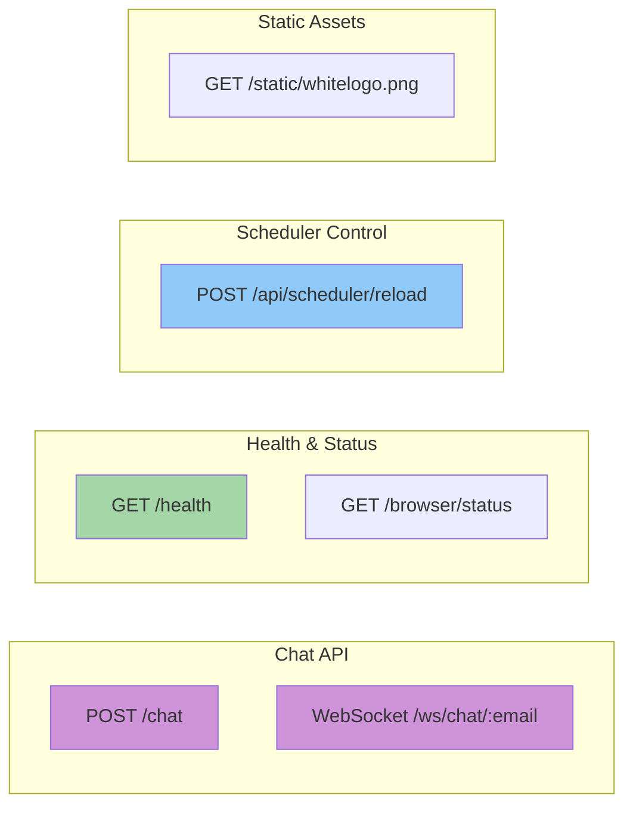
```mermaid
graph LR
    subgraph "Chat API"
        C1[POST /chat]
        C2[WebSocket /ws/chat/:email]
    end

    subgraph "Health & Status"
        H1[GET /health]
        H2[GET /browser/status]
    end

    subgraph "Scheduler Control"
        SC1[POST /api/scheduler/reload]
    end

    subgraph "Static Assets"
        ST1[GET /static/whitelogo.png]
    end

    style C1 fill:#ce93d8
    style C2 fill:#ce93d8
    style H1 fill:#a5d6a7
    style SC1 fill:#90caf9
```

### API Request/Response Examples

**POST /api/signup**
```json
// Request
{
  "username": "john_doe",
  "email": "john@example.com",
  "password": "SecurePass123!"
}

// Response (200)
{
  "message": "Verification code sent to email",
  "email": "john@example.com"
}
```

**WebSocket /ws/chat/:email**
```json
// Client -> Server
{
  "type": "message",
  "message": "Go to Twitter and like the first post"
}

// Server -> Client (streaming)
{
  "type": "automation_started"
}
{
  "type": "automation_step_realtime",
  "step_number": 1,
  "goal": "Navigate to Twitter"
}
{
  "type": "automation_step_update",
  "action": "navigate",
  "url": "https://twitter.com"
}
{
  "type": "complete",
  "final_output": "Successfully liked the first post on Twitter"
}
```

---

## WebSocket Communication Flow

### Connection Lifecycle

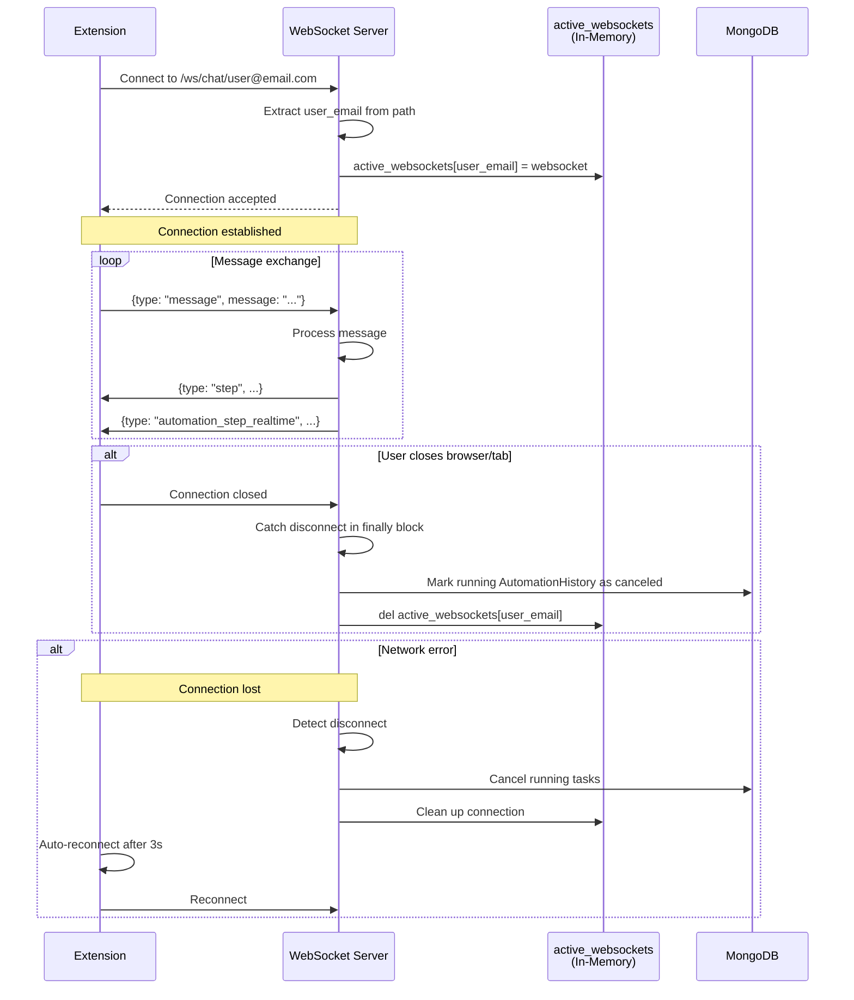
```mermaid
sequenceDiagram
    participant EXT as Extension
    participant WS as WebSocket Server
    participant STORE as active_websockets<br/>(In-Memory)
    participant DB as MongoDB

    EXT->>WS: Connect to /ws/chat/user@email.com
    WS->>WS: Extract user_email from path
    WS->>STORE: active_websockets[user_email] = websocket
    WS-->>EXT: Connection accepted

    Note over EXT,WS: Connection established

    loop Message exchange
        EXT->>WS: {type: "message", message: "..."}
        WS->>WS: Process message
        WS->>EXT: {type: "step", ...}
        WS->>EXT: {type: "automation_step_realtime", ...}
    end

    alt User closes browser/tab
        EXT->>WS: Connection closed
        WS->>WS: Catch disconnect in finally block
        WS->>DB: Mark running AutomationHistory as canceled
        WS->>STORE: del active_websockets[user_email]
    end

    alt Network error
        Note over EXT,WS: Connection lost
        WS->>WS: Detect disconnect
        WS->>DB: Cancel running tasks
        WS->>STORE: Clean up connection

        EXT->>EXT: Auto-reconnect after 3s
        EXT->>WS: Reconnect
    end
```

### Message Types Flow

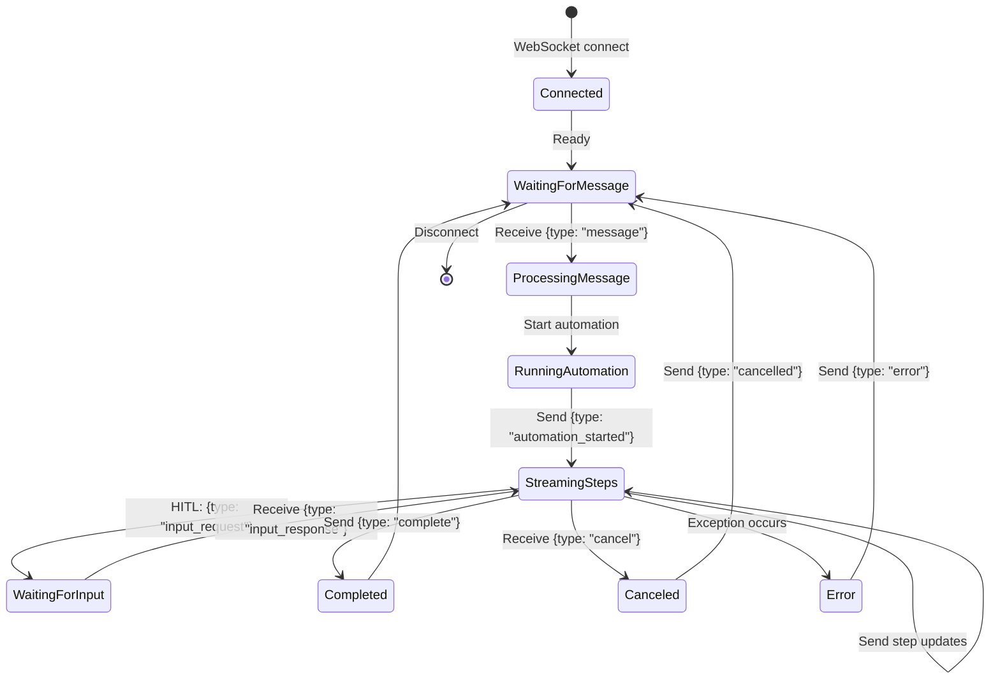
```mermaid
stateDiagram-v2
    [*] --> Connected: WebSocket connect

    Connected --> WaitingForMessage: Ready

    WaitingForMessage --> ProcessingMessage: Receive {type: "message"}
    ProcessingMessage --> RunningAutomation: Start automation

    RunningAutomation --> StreamingSteps: Send {type: "automation_started"}
    StreamingSteps --> StreamingSteps: Send step updates
    StreamingSteps --> WaitingForInput: HITL: {type: "input_request"}
    WaitingForInput --> StreamingSteps: Receive {type: "input_response"}

    StreamingSteps --> Completed: Send {type: "complete"}
    StreamingSteps --> Canceled: Receive {type: "cancel"}
    StreamingSteps --> Error: Exception occurs

    Completed --> WaitingForMessage
    Canceled --> WaitingForMessage: Send {type: "cancelled"}
    Error --> WaitingForMessage: Send {type: "error"}

    WaitingForMessage --> [*]: Disconnect
```

---

## Human-in-the-Loop Flow

### Ask Human Tool Flow

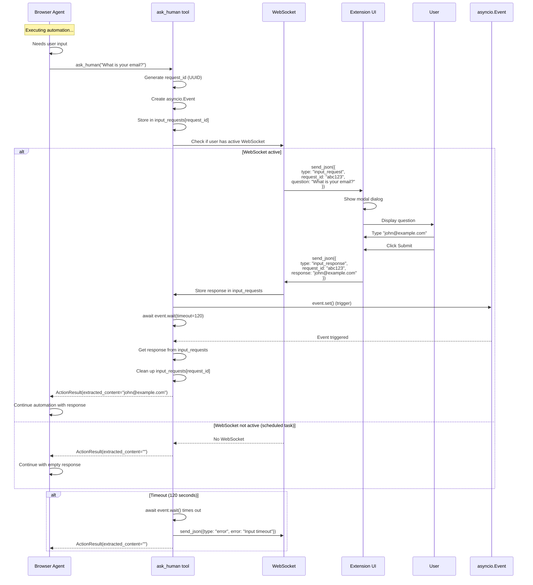
```mermaid
sequenceDiagram
    participant BA as Browser Agent
    participant TOOL as ask_human tool
    participant WS as WebSocket
    participant EXT as Extension UI
    participant U as User
    participant EVENT as asyncio.Event

    Note over BA: Executing automation...
    BA->>BA: Needs user input
    BA->>TOOL: ask_human("What is your email?")

    TOOL->>TOOL: Generate request_id (UUID)
    TOOL->>TOOL: Create asyncio.Event
    TOOL->>TOOL: Store in input_requests[request_id]

    TOOL->>WS: Check if user has active WebSocket
    alt WebSocket active
        WS->>EXT: send_json({<br/>  type: "input_request",<br/>  request_id: "abc123",<br/>  question: "What is your email?"<br/>})

        EXT->>EXT: Show modal dialog
        EXT->>U: Display question
        U->>EXT: Type "john@example.com"
        U->>EXT: Click Submit

        EXT->>WS: send_json({<br/>  type: "input_response",<br/>  request_id: "abc123",<br/>  response: "john@example.com"<br/>})

        WS->>TOOL: Store response in input_requests
        TOOL->>EVENT: event.set() (trigger)

        TOOL->>TOOL: await event.wait(timeout=120)
        EVENT-->>TOOL: Event triggered
        TOOL->>TOOL: Get response from input_requests
        TOOL->>TOOL: Clean up input_requests[request_id]

        TOOL-->>BA: ActionResult(extracted_content="john@example.com")
        BA->>BA: Continue automation with response

    else WebSocket not active (scheduled task)
        WS-->>TOOL: No WebSocket
        TOOL-->>BA: ActionResult(extracted_content="")
        BA->>BA: Continue with empty response
    end

    alt Timeout (120 seconds)
        TOOL->>TOOL: await event.wait() times out
        TOOL->>WS: send_json({type: "error", error: "Input timeout"})
        TOOL-->>BA: ActionResult(extracted_content="")
    end
```

### Wait for 2FA Tool Flow

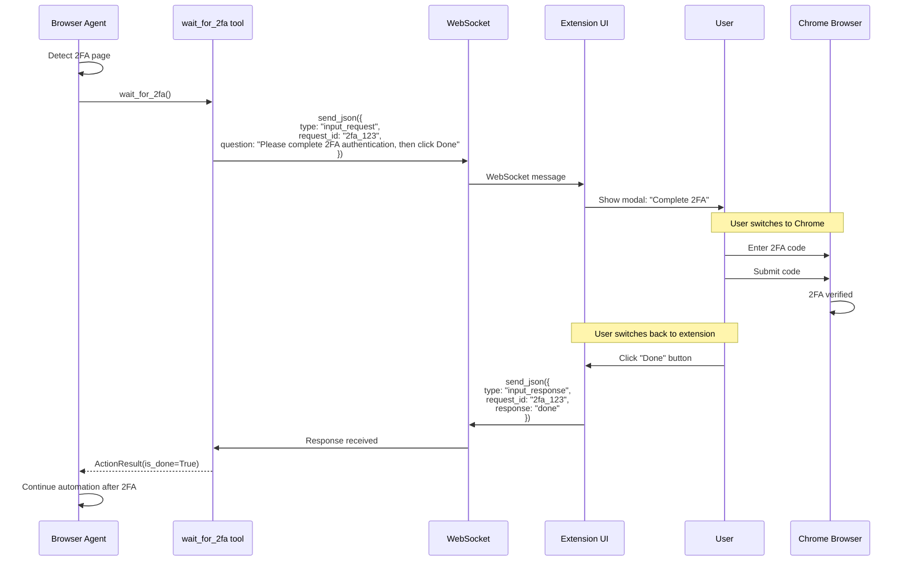
```mermaid
sequenceDiagram
    participant BA as Browser Agent
    participant TOOL as wait_for_2fa tool
    participant WS as WebSocket
    participant EXT as Extension UI
    participant U as User
    participant BROWSER as Chrome Browser

    BA->>BA: Detect 2FA page
    BA->>TOOL: wait_for_2fa()

    TOOL->>WS: send_json({<br/>  type: "input_request",<br/>  request_id: "2fa_123",<br/>  question: "Please complete 2FA authentication, then click Done"<br/>})

    WS->>EXT: WebSocket message
    EXT->>U: Show modal: "Complete 2FA"

    Note over U,BROWSER: User switches to Chrome
    U->>BROWSER: Enter 2FA code
    U->>BROWSER: Submit code
    BROWSER->>BROWSER: 2FA verified

    Note over U,EXT: User switches back to extension
    U->>EXT: Click "Done" button
    EXT->>WS: send_json({<br/>  type: "input_response",<br/>  request_id: "2fa_123",<br/>  response: "done"<br/>})

    WS->>TOOL: Response received
    TOOL-->>BA: ActionResult(is_done=True)
    BA->>BA: Continue automation after 2FA
```

### Task Cancellation Flow

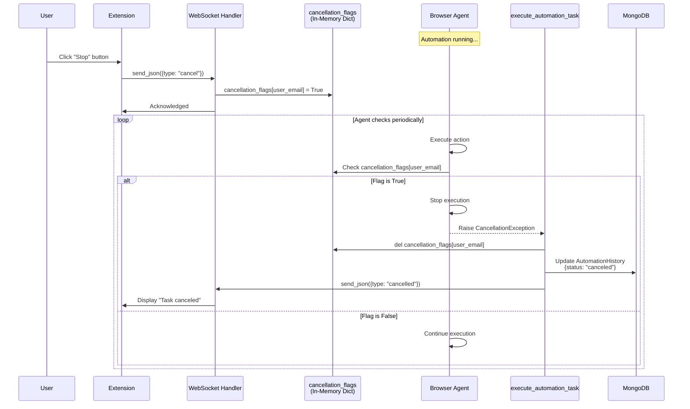
```mermaid
sequenceDiagram
    participant U as User
    participant EXT as Extension
    participant WS as WebSocket Handler
    participant FLAG as cancellation_flags<br/>(In-Memory Dict)
    participant BA as Browser Agent
    participant EXEC as execute_automation_task
    participant DB as MongoDB

    Note over BA: Automation running...

    U->>EXT: Click "Stop" button
    EXT->>WS: send_json({type: "cancel"})

    WS->>FLAG: cancellation_flags[user_email] = True
    WS->>EXT: Acknowledged

    loop Agent checks periodically
        BA->>BA: Execute action
        BA->>FLAG: Check cancellation_flags[user_email]
        alt Flag is True
            BA->>BA: Stop execution
            BA-->>EXEC: Raise CancellationException
            EXEC->>FLAG: del cancellation_flags[user_email]
            EXEC->>DB: Update AutomationHistory<br/>{status: "canceled"}
            EXEC->>WS: send_json({type: "cancelled"})
            WS->>EXT: Display "Task canceled"
        else Flag is False
            BA->>BA: Continue execution
        end
    end
```

---

## Complete End-to-End Flow

### Full User Journey: From Login to Automation Completion

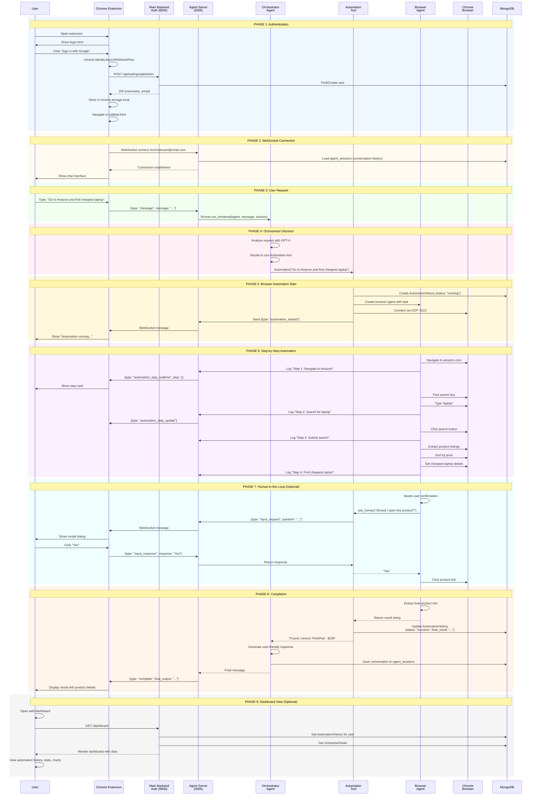
```mermaid
sequenceDiagram
    participant U as User
    participant EXT as Chrome Extension
    participant AUTH as Main Backend<br/>Auth (8000)
    participant AGENT as Agent Server<br/>(5005)
    participant ORC as Orchestrator<br/>Agent
    participant TOOL as Automation<br/>Tool
    participant BA as Browser<br/>Agent
    participant CHROME as Chrome<br/>Browser
    participant DB as MongoDB

    rect rgb(240, 248, 255)
        Note over U,DB: PHASE 1: Authentication
        U->>EXT: Open extension
        EXT->>U: Show login.html
        U->>EXT: Click "Sign in with Google"
        EXT->>EXT: chrome.identity.launchWebAuthFlow
        EXT->>AUTH: POST /api/auth/google/token
        AUTH->>DB: Find/Create user
        AUTH-->>EXT: 200 {username, email}
        EXT->>EXT: Store in chrome.storage.local
        EXT->>EXT: Navigate to sidebar.html
    end

    rect rgb(255, 250, 240)
        Note over U,DB: PHASE 2: WebSocket Connection
        EXT->>AGENT: WebSocket connect /ws/chat/user@email.com
        AGENT->>DB: Load agent_sessions (conversation history)
        AGENT-->>EXT: Connection established
        EXT->>U: Show chat interface
    end

    rect rgb(240, 255, 240)
        Note over U,DB: PHASE 3: User Request
        U->>EXT: Type: "Go to Amazon and find cheapest laptop"
        EXT->>AGENT: {type: "message", message: "..."}
        AGENT->>ORC: Runner.run_streamed(agent, message, session)
    end

    rect rgb(255, 240, 245)
        Note over U,DB: PHASE 4: Orchestrator Decision
        ORC->>ORC: Analyze request with GPT-4
        ORC->>ORC: Decide to use Automation tool
        ORC->>TOOL: Automation("Go to Amazon and find cheapest laptop")
    end

    rect rgb(255, 248, 220)
        Note over U,DB: PHASE 5: Browser Automation Start
        TOOL->>DB: Create AutomationHistory {status: "running"}
        TOOL->>BA: Create browser agent with task
        TOOL->>CHROME: Connect via CDP :9222
        TOOL->>AGENT: Send {type: "automation_started"}
        AGENT->>EXT: WebSocket message
        EXT->>U: Show "Automation running..."
    end

    rect rgb(250, 240, 255)
        Note over U,DB: PHASE 6: Step-by-Step Automation
        BA->>CHROME: Navigate to amazon.com
        BA->>AGENT: Log "Step 1: Navigate to Amazon"
        AGENT->>EXT: {type: "automation_step_realtime", step: 1}
        EXT->>U: Show step card

        BA->>CHROME: Find search box
        BA->>CHROME: Type "laptop"
        BA->>AGENT: Log "Step 2: Search for laptop"
        AGENT->>EXT: {type: "automation_step_update"}

        BA->>CHROME: Click search button
        BA->>AGENT: Log "Step 3: Submit search"

        BA->>CHROME: Extract product listings
        BA->>CHROME: Sort by price
        BA->>CHROME: Get cheapest laptop details
        BA->>AGENT: Log "Step 4: Find cheapest option"
    end

    rect rgb(240, 255, 255)
        Note over U,DB: PHASE 7: Human-in-the-Loop (Optional)
        BA->>BA: Needs user confirmation
        BA->>TOOL: ask_human("Should I open this product?")
        TOOL->>AGENT: {type: "input_request", question: "..."}
        AGENT->>EXT: WebSocket message
        EXT->>U: Show modal dialog
        U->>EXT: Click "Yes"
        EXT->>AGENT: {type: "input_response", response: "Yes"}
        AGENT->>TOOL: Return response
        TOOL-->>BA: "Yes"
        BA->>CHROME: Click product link
    end

    rect rgb(255, 245, 235)
        Note over U,DB: PHASE 8: Completion
        BA->>BA: Extract final product info
        BA-->>TOOL: Return result string
        TOOL->>DB: Update AutomationHistory<br/>{status: "success", final_result: "..."}
        TOOL-->>ORC: "Found: Lenovo ThinkPad - $299"

        ORC->>ORC: Generate user-friendly response
        ORC->>DB: Save conversation to agent_sessions
        ORC-->>AGENT: Final message
        AGENT->>EXT: {type: "complete", final_output: "..."}
        EXT->>U: Display result with product details
    end

    rect rgb(245, 245, 245)
        Note over U,DB: PHASE 9: Dashboard View (Optional)
        U->>U: Open web dashboard
        U->>AUTH: GET /dashboard
        AUTH->>DB: Get AutomationHistory for user
        AUTH->>DB: Get ScheduledTasks
        AUTH-->>U: Render dashboard with data
        U->>U: View automation history, stats, charts
    end
```

---

## System Integration Points

### Chrome Extension Integration Points

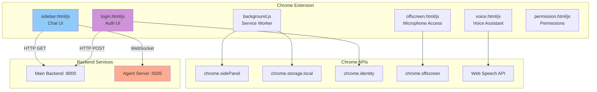
```mermaid
graph TB
    subgraph "Chrome Extension"
        A1[background.js<br/>Service Worker]
        A2[sidebar.html/js<br/>Chat UI]
        A3[login.html/js<br/>Auth UI]
        A4[voice.html/js<br/>Voice Assistant]
        A5[offscreen.html/js<br/>Microphone Access]
        A6[permission.html/js<br/>Permissions]
    end

    subgraph "Chrome APIs"
        B1[chrome.sidePanel]
        B2[chrome.storage.local]
        B3[chrome.identity]
        B4[chrome.offscreen]
        B5[Web Speech API]
    end

    subgraph "Backend Services"
        C1[Main Backend :8000]
        C2[Agent Server :5005]
    end

    A1 --> B1
    A1 --> B2
    A3 --> B3
    A4 --> B5
    A5 --> B4

    A2 -->|WebSocket| C2
    A3 -->|HTTP POST| C1
    A2 -->|HTTP GET| C1

    style A2 fill:#90caf9
    style A3 fill:#ce93d8
    style C2 fill:#ffab91
```

### Database Integration Points

```mermaid
graph LR
    subgraph "Services"
        S1[Main Backend]
        S2[Agent Server]
        S3[Task Scheduler]
    end

    subgraph "MongoDB Operations"
        O1[User CRUD]
        O2[Auth & Sessions]
        O3[Automation History]
        O4[Scheduled Tasks]
        O5[Agent Sessions]
    end

    S1 --> O1
    S1 --> O2
    S1 --> O3
    S1 --> O4

    S2 --> O3
    S2 --> O5
    S2 --> O2

    S3 --> O4
    S3 --> O3

    style S1 fill:#fff9c4
    style S2 fill:#f8bbd0
    style S3 fill:#c5e1a5
```

---

## Execution Context Diagram

### Browser Automation Context

```mermaid
graph TB
    subgraph "Execution Contexts"
        subgraph "Python Context"
            P1[FastAPI Server<br/>Async Event Loop]
            P2[OpenAI Agent SDK<br/>Runner]
            P3[browser-use<br/>Agent]
            P4[Playwright<br/>CDP Client]
        end

        subgraph "Browser Context"
            B1[Chrome Instance<br/>Port 9222]
            B2[Web Page<br/>JavaScript Context]
            B3[DOM<br/>Document Model]
        end

        subgraph "Network Context"
            N1[WebSocket<br/>Bi-directional]
            N2[HTTP<br/>Request/Response]
            N3[CDP Protocol<br/>JSON-RPC]
        end
    end

    P1 --> P2
    P2 --> P3
    P3 --> P4
    P4 -->|CDP| N3
    N3 --> B1
    B1 --> B2
    B2 --> B3

    P1 -->|Stream| N1
    P1 -->|REST API| N2

    style P1 fill:#e1bee7
    style B1 fill:#ffccbc
    style N1 fill:#b2ebf2
```

---

## Error Handling Flow

```mermaid
stateDiagram-v2
    [*] --> TaskStarted: User sends message

    TaskStarted --> AutomationRunning: Create AutomationHistory

    AutomationRunning --> Success: Browser agent completes
    AutomationRunning --> BrowserError: CDP connection lost
    AutomationRunning --> AgentError: Agent exception
    AutomationRunning --> Timeout: Exceeds max time
    AutomationRunning --> UserCanceled: User clicks stop
    AutomationRunning --> NetworkError: WebSocket disconnect

    Success --> UpdateDB: status = "success"
    BrowserError --> UpdateDB: status = "failed"<br/>errors = [CDP error]
    AgentError --> UpdateDB: status = "failed"<br/>errors = [exception]
    Timeout --> UpdateDB: status = "failed"<br/>errors = [timeout]
    UserCanceled --> UpdateDB: status = "canceled"
    NetworkError --> UpdateDB: status = "canceled"<br/>reason = "disconnect"

    UpdateDB --> NotifyUser: Send WebSocket message
    NotifyUser --> Cleanup: Close browser context
    Cleanup --> [*]

    note right of Success
        Send {type: "complete"}
        with final_output
    end note

    note right of BrowserError
        Send {type: "error"}
        Reconnect to browser
    end note

    note right of UserCanceled
        Send {type: "cancelled"}
        Clean up flags
    end note
```

---

## Performance Considerations

### Concurrent User Handling

```mermaid
graph TB
    subgraph "Current Architecture (Single Browser)"
        U1[User 1] --> WS1[WebSocket 1]
        U2[User 2] --> WS2[WebSocket 2]
        U3[User 3] --> WS3[WebSocket 3]

        WS1 --> QUEUE[Task Queue<br/>Sequential]
        WS2 --> QUEUE
        WS3 --> QUEUE

        QUEUE --> CHROME[Single Chrome<br/>Instance :9222]

        Note1[Bottleneck:<br/>Users wait in queue]
    end

    subgraph "Recommended Architecture (Browser Pool)"
        U4[User 1] --> WS4[WebSocket 1]
        U5[User 2] --> WS5[WebSocket 2]
        U6[User 3] --> WS6[WebSocket 3]

        WS4 --> LB[Load Balancer]
        WS5 --> LB
        WS6 --> LB

        LB --> C1[Chrome 1<br/>:9222]
        LB --> C2[Chrome 2<br/>:9223]
        LB --> C3[Chrome 3<br/>:9224]

        Note2[Parallel Execution:<br/>No waiting]
    end

    style CHROME fill:#ffcdd2
    style Note1 fill:#fff9c4
    style C1 fill:#c8e6c9
    style C2 fill:#c8e6c9
    style C3 fill:#c8e6c9
    style Note2 fill:#c8e6c9
```

---

## Security Architecture

### Authentication Security Layers

```mermaid
graph TB
    subgraph "Security Layers"
        L1[Transport Layer<br/>HTTPS/WSS]
        L2[Session Layer<br/>Encrypted Cookies]
        L3[Password Layer<br/>Argon2 Hashing]
        L4[OAuth Layer<br/>Google Identity]
        L5[Database Layer<br/>MongoDB Auth]
    end

    subgraph "Security Measures"
        M1[Email Verification<br/>6-digit code]
        M2[TTL Indexes<br/>Auto-expire codes]
        M3[Session Management<br/>Secure cookies]
        M4[Input Validation<br/>Pydantic models]
        M5[CORS Policy<br/>Allowed origins]
    end

    L1 --> M3
    L2 --> M3
    L3 --> M1
    L4 --> M1
    L5 --> M2

    M3 --> M4
    M4 --> M5

    style L1 fill:#e8f5e9
    style L3 fill:#fff3e0
    style M1 fill:#f3e5f5
```

### Data Flow Security

```mermaid
sequenceDiagram
    participant U as User
    participant EXT as Extension
    participant API as Backend
    participant DB as Database

    rect rgb(255, 240, 245)
        Note over U,DB: Password Storage
        U->>EXT: Enter password
        EXT->>API: POST /api/signup {password: "plain"}
        API->>API: Argon2 hash with salt
        API->>DB: Store only hash
        Note over DB: Password never stored in plain text
    end

    rect rgb(240, 248, 255)
        Note over U,DB: Session Management
        U->>API: POST /api/login
        API->>API: Verify password hash
        API->>API: Create session (secret key)
        API-->>EXT: Set-Cookie: session_id (HttpOnly)
        Note over EXT: Cookie not accessible to JavaScript
    end

    rect rgb(255, 251, 230)
        Note over U,DB: OAuth Flow
        U->>EXT: Sign in with Google
        EXT->>EXT: chrome.identity (secure)
        EXT->>API: Send access_token
        API->>API: Verify token with Google
        API->>DB: Store google_id, no password
        Note over DB: OAuth users have password = null
    end
```

---

## Monitoring & Health Checks

### Health Check Flow

```mermaid
graph TB
    subgraph "Health Endpoints"
        H1[GET /health<br/>Agent Server]
        H2[GET /browser/status<br/>Agent Server]
    end

    subgraph "Health Checks"
        C1{Browser<br/>Connected?}
        C2{Scheduler<br/>Running?}
        C3{Database<br/>Accessible?}
    end

    subgraph "Responses"
        R1[200 OK<br/>All systems operational]
        R2[503 Service Unavailable<br/>Browser disconnected]
        R3[503 Service Unavailable<br/>Scheduler stopped]
    end

    H1 --> C1
    H1 --> C2
    H2 --> C1

    C1 -->|Yes| C2
    C1 -->|No| R2
    C2 -->|Yes| C3
    C2 -->|No| R3
    C3 -->|Yes| R1
    C3 -->|No| R3

    style R1 fill:#c8e6c9
    style R2 fill:#ffcdd2
    style R3 fill:#ffcdd2
```

---

## Deployment Architecture

### Development Environment

```mermaid
graph TB
    subgraph "Local Development"
        D1[Terminal 1<br/>python main.py]
        D2[Terminal 2<br/>python agent_server.py]
        D3[Terminal 3<br/>Chrome --remote-debugging-port=9222]
        D4[MongoDB<br/>localhost:27017]
        D5[Chrome Extension<br/>Load unpacked]
    end

    D1 -->|Port 8000| WEB[Web Browser]
    D2 -->|Port 5005| D5
    D5 -->|CDP :9222| D3
    D1 --> D4
    D2 --> D4

    style D1 fill:#fff9c4
    style D2 fill:#f8bbd0
    style D3 fill:#b2dfdb
    style D4 fill:#ffccbc
```

### Production Deployment (Recommended)

```mermaid
graph TB
    subgraph "Load Balancer"
        LB[Nginx/Traefik]
    end

    subgraph "Application Layer"
        A1[Main Backend<br/>Replicas: 3]
        A2[Agent Server<br/>Replicas: 5]
    end

    subgraph "Browser Layer"
        B1[Chrome Pool<br/>Browserless.io<br/>10 instances]
    end

    subgraph "Data Layer"
        D1[(MongoDB Atlas<br/>Replica Set)]
        D2[(Redis<br/>Session Store)]
    end

    subgraph "Monitoring"
        M1[Prometheus]
        M2[Grafana]
        M3[Sentry]
    end

    LB --> A1
    LB --> A2
    A2 --> B1
    A1 --> D1
    A2 --> D1
    A1 --> D2
    A2 --> D2

    A1 --> M3
    A2 --> M3
    A1 --> M1
    A2 --> M1
    M1 --> M2

    style LB fill:#90caf9
    style A1 fill:#fff9c4
    style A2 fill:#f8bbd0
    style B1 fill:#b2dfdb
    style D1 fill:#ffccbc
    style M2 fill:#c5e1a5
```

---

## Technology Stack Summary

```mermaid
mindmap
  root((FYP Auto))
    Frontend
      Chrome Extension
        Manifest V3
        WebSocket Client
        Chrome APIs
      Web Dashboard
        HTML/CSS/JS
        Chart.js
        Responsive Design
    Backend
      FastAPI
        Async/Await
        Pydantic Validation
        SessionMiddleware
      OpenAI Agent SDK
        GPT-4.1-mini
        Function Tools
        Streaming
      browser-use
        Playwright CDP
        Agent Actions
        Custom Tools
    Database
      MongoDB
        Motor Async Driver
        TTL Indexes
        Document Model
    Infrastructure
      Python 3.11+
      APScheduler
        Cron Triggers
        Async Jobs
      Chrome CDP
        Port 9222
        Remote Debugging
    Security
      Argon2
        Password Hashing
      Google OAuth
        Identity API
      Email Verification
        SMTP
        TTL Codes
```

---

## Key Architectural Patterns

### 1. Orchestrator Pattern
```
User Request → Orchestrator Agent → Decision → Tool Selection → Browser Agent → Actions
```
**Benefits**: Conversational AI, multi-tool capability, session memory

### 2. Streaming Pattern
```
Agent Execution → Stream Events → WebSocket → Real-time UI Updates
```
**Benefits**: Live progress, better UX, immediate feedback

### 3. Human-in-the-Loop Pattern
```
Agent Needs Input → Request via WebSocket → User Responds → Agent Continues
```
**Benefits**: Dynamic workflows, 2FA handling, user control

### 4. Session Persistence Pattern
```
User Message → Load Session from DB → Process → Save Session → Next Message Uses History
```
**Benefits**: Context awareness, conversation continuity

### 5. Task Scheduling Pattern
```
User Creates Task → Store in DB → Scheduler Loads → Cron Trigger → Execute → Update
```
**Benefits**: Automation, recurring tasks, unattended execution

---

## Critical File Reference

| Component | File | Lines | Purpose |
|-----------|------|-------|---------|
| Main Backend | main.py | 1884 | Auth, CRUD, web routes |
| Agent Orchestrator | agent_server.py | 1125 | AI logic, WebSocket, browser automation |
| Task Automation | task_scheduler.py | 359 | APScheduler, cron triggers |
| Database Models | models.py | 335 | Motor async, CRUD operations |
| Session Storage | mongodb_session.py | 222 | Agent conversation memory |
| Extension UI | sidebar.js | 1521 | WebSocket client, real-time display |
| Extension Auth | login.js | 323 | Google OAuth, form handling |
| Dashboard Logic | dashboard.js | ~500 | Charts, tables, task management |

---

## Conclusion

This comprehensive architecture diagram covers:
- Complete system flow from user interaction to database
- Authentication mechanisms (email/password & OAuth)
- Real-time automation execution with streaming
- Task scheduling and automated execution
- Human-in-the-loop integration
- Database schema and relationships
- API endpoint mapping
- WebSocket communication protocols
- Security layers and error handling
- Deployment architecture

The system demonstrates a well-architected, production-ready browser automation platform with AI orchestration, real-time streaming, and robust task management capabilities.
